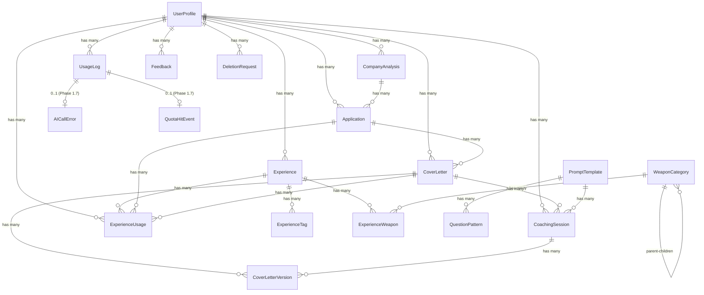

# 데이터 구조

> 작성일: 2026-02-11 (2026-02-13 인증 아키텍처 변경, 2026-02-19 Phase 1.6/1.7 테이블 반영)
> PostgreSQL + pgvector + Ent ORM

---

## 1. Source of Truth

**Ent 스키마 정의가 단일 진실 공급원(Single Source of Truth)**이다.

```text
apps/backend/ent/schema/
├── mixin.go              # 공통 필드 (BaseMixin, TimestampMixin)
├── userprofile.go        # 사용자 프로필
├── experience.go         # 경험 등록
├── experiencetag.go      # 경험 역량 태그
├── experienceweapon.go   # 경험-무기 매핑
├── experienceusage.go    # 경험 사용 이력
├── weaponcategory.go     # 무기 카테고리 마스터
├── prompttemplate.go     # AI 프롬프트 템플릿
├── questionpattern.go    # 자소서 문항 패턴
├── companyanalysiscache.go  # 기업 분석 캐시
├── talentprofile.go      # 기업 인재상 DB
├── application.go        # 지원 현황
├── companyanalysis.go    # 기업 분석 결과
├── coverletter.go        # 자소서
├── coverletterversion.go # 자소서 버전
├── coachingsession.go    # 코칭 세션
│
│   ── Phase 1.6 어드민 ──
├── usagelog.go           # AI 호출 사용량 로그
├── systemconfig.go       # 시스템 설정
├── adminauditlog.go      # 어드민 감사 로그
├── feedback.go           # 사용자 피드백
├── deletionrequest.go    # 계정 삭제 요청 (PIPA)
│
│   ── Phase 1.7 어드민 관찰성 (구현 예정) ──
├── aicallerror.go        # AI 호출 에러 상세 (usage_logs 1:1 확장)
└── quotahitevent.go      # Rate limit 이벤트 영속화
```

- SQL 마이그레이션은 Ent 스키마에서 **Atlas**가 자동 생성
- 스키마 변경 시 Ent 파일만 수정 → `moon run backend:migrate-diff` → SQL 자동 생성

---

## 2. Ent 스키마 패턴

### 핵심 메서드

| 메서드 | 역할 |
|--------|------|
| `Fields()` | 테이블 컬럼 정의 (타입, 제약조건, 기본값) |
| `Edges()` | 테이블 간 관계 정의 (1:N, M:N, 1:1) |
| `Indexes()` | 복합 인덱스, 유니크 제약조건 |
| `Mixin()` | 공통 필드 재사용 (id, created_at, updated_at) |

### Edge 방향 규칙

```
edge.To("children", Child.Type)      // 소유 관계 (FK가 Child에 생성)
edge.From("parent", Parent.Type)     // 역참조 (Ref로 연결)
  .Ref("children")
  .Unique()                          // 1:1 또는 N:1
```

### Annotation 패턴

```go
// CASCADE 삭제
Annotations(entsql.OnDelete(entsql.Cascade))

// SET NULL 삭제
Annotations(entsql.OnDelete(entsql.SetNull))
```

---

## 3. Ent 스키마 정의 (22 테이블)

> 3.1–3.15: 코어 도메인 | 3.16–3.20: Phase 1.6 어드민 | 3.21–3.22: Phase 1.7 어드민 관찰성 (구현 예정)

### 3.0 Mixin (공통 필드)

```go
// apps/backend/ent/schema/mixin.go
package schema

import (
	"time"

	"entgo.io/ent"
	"entgo.io/ent/schema/field"
	"entgo.io/ent/schema/mixin"
	"github.com/google/uuid"
)

// BaseMixin — 모든 엔티티의 공통 필드 (id, created_at, updated_at)
type BaseMixin struct {
	mixin.Schema
}

func (BaseMixin) Fields() []ent.Field {
	return []ent.Field{
		field.UUID("id", uuid.UUID{}).
			Default(uuid.New).
			Immutable().
			Comment("Primary key"),
		field.Time("created_at").
			Default(time.Now).
			Immutable().
			Comment("Record creation timestamp"),
		field.Time("updated_at").
			Default(time.Now).
			UpdateDefault(time.Now).
			Comment("Record last update timestamp"),
	}
}

// TimestampMixin — created_at만 필요한 엔티티용
type TimestampMixin struct {
	mixin.Schema
}

func (TimestampMixin) Fields() []ent.Field {
	return []ent.Field{
		field.UUID("id", uuid.UUID{}).
			Default(uuid.New).
			Immutable().
			Comment("Primary key"),
		field.Time("created_at").
			Default(time.Now).
			Immutable().
			Comment("Record creation timestamp"),
	}
}
```

---

### 3.1 UserProfile (사용자 프로필)

> **⚠️ Phase 1 변경**: Supabase Auth 제거, 자체 인증으로 전환.
> `user_id` (Supabase auth.users 참조) 제거 → `id` (BaseMixin PK)가 곧 user_id.
> 인증 필드 추가: email, password_hash, naver_id, auth_provider, role, email_verified, last_login_at.

```go
// apps/backend/ent/schema/userprofile.go
package schema

import (
	"entgo.io/ent"
	"entgo.io/ent/schema/edge"
	"entgo.io/ent/schema/field"
	"entgo.io/ent/schema/index"
)

type UserProfile struct {
	ent.Schema
}

func (UserProfile) Mixin() []ent.Mixin {
	return []ent.Mixin{
		BaseMixin{},
	}
}

func (UserProfile) Fields() []ent.Field {
	return []ent.Field{
		// --- 인증 필드 ---
		field.String("email").
			Optional().
			Nillable().
			MaxLen(255).
			Comment("Email address"),
		field.String("password_hash").
			Optional().
			Nillable().
			MaxLen(255).
			Sensitive().
			Comment("bcrypt hashed password (email auth only)"),
		field.String("naver_id").
			Optional().
			Nillable().
			MaxLen(255).
			Comment("Naver OAuth user ID"),
		field.Enum("auth_provider").
			Values("email", "naver").
			Default("email").
			Comment("Authentication provider"),
		field.Enum("role").
			Values("user", "admin").
			Default("user").
			Comment("User role"),
		field.Bool("email_verified").
			Default(false).
			Comment("Whether email is verified"),
		field.Time("last_login_at").
			Optional().
			Nillable().
			Comment("Last login timestamp"),

		// --- 프로필 필드 ---
		field.String("nickname").
			Optional().
			MaxLen(50).
			Comment("Display name"),
		field.String("target_job").
			Optional().
			MaxLen(100).
			Comment("Target job position"),
		field.String("target_industry").
			Optional().
			MaxLen(100).
			Comment("Target industry"),
		field.String("education_level").
			Optional().
			MaxLen(20).
			Comment("Education level: 고졸, 대졸, 석사, 박사"),
		field.Int("graduation_year").
			Optional().
			Nillable().
			Comment("Graduation year"),
		field.Int("experience_years").
			Default(0).
			Comment("Years of experience (0 for new grad)"),
		field.Bool("onboarding_completed").
			Default(false).
			Comment("Whether onboarding is completed"),
	}
}

func (UserProfile) Edges() []ent.Edge {
	return []ent.Edge{
		edge.To("experiences", Experience.Type),
		edge.To("applications", Application.Type),
		edge.To("company_analyses", CompanyAnalysis.Type),
		edge.To("cover_letters", CoverLetter.Type),
		edge.To("coaching_sessions", CoachingSession.Type),
		edge.To("experience_usages", ExperienceUsage.Type),
	}
}

func (UserProfile) Indexes() []ent.Index {
	return []ent.Index{
		index.Fields("email").Unique(),
		index.Fields("naver_id").Unique(),
		index.Fields("role"),
	}
}
```

---

### 3.2 Experience (경험 등록)

```go
// apps/backend/ent/schema/experience.go
package schema

import (
	"entgo.io/ent"
	"entgo.io/ent/dialect/entsql"
	"entgo.io/ent/schema/edge"
	"entgo.io/ent/schema/field"
	"entgo.io/ent/schema/index"
	"github.com/google/uuid"
)

type Experience struct {
	ent.Schema
}

func (Experience) Mixin() []ent.Mixin {
	return []ent.Mixin{
		BaseMixin{},
	}
}

func (Experience) Fields() []ent.Field {
	return []ent.Field{
		field.UUID("user_id", uuid.UUID{}).
			Comment("References user_profiles(id)"),
		field.String("title").
			NotEmpty().
			MaxLen(200).
			Comment("Experience title"),
		field.String("category").
			Optional().
			MaxLen(50).
			Comment("Activity type: 인턴, 대외활동, 프로젝트, 아르바이트"),
		field.Time("period_start").
			Optional().
			Nillable().
			Comment("Start date"),
		field.Time("period_end").
			Optional().
			Nillable().
			Comment("End date"),
		field.String("role").
			Optional().
			MaxLen(100).
			Comment("Role in the experience"),
		field.Text("content").
			NotEmpty().
			Comment("Detailed experience content"),
		field.Text("result").
			Optional().
			Comment("Outcome / achievements"),
		field.Text("star_situation").
			Optional().
			Comment("STAR: Situation"),
		field.Text("star_task").
			Optional().
			Comment("STAR: Task"),
		field.Text("star_action").
			Optional().
			Comment("STAR: Action"),
		field.Text("star_result").
			Optional().
			Comment("STAR: Result"),
		field.JSON("keywords", []string{}).
			Optional().
			Comment("Core keywords array"),
		// embedding VECTOR(1536) — handled via raw SQL migration
		field.String("source").
			Default("manual").
			MaxLen(20).
			Comment("Input method: manual, interview"),
		field.Bool("is_archived").
			Default(false).
			Comment("Whether experience is archived"),
	}
}

func (Experience) Edges() []ent.Edge {
	return []ent.Edge{
		edge.From("user", UserProfile.Type).
			Ref("experiences").
			Unique().
			Required().
			Field("user_id").
			Annotations(entsql.OnDelete(entsql.Cascade)),
		edge.To("tags", ExperienceTag.Type),
		edge.To("weapons", ExperienceWeapon.Type),
		edge.To("usages", ExperienceUsage.Type),
	}
}

func (Experience) Indexes() []ent.Index {
	return []ent.Index{
		index.Fields("user_id"),
		index.Fields("user_id", "category"),
		index.Fields("user_id", "created_at"),
		index.Fields("user_id", "is_archived"),
	}
}
```

---

### 3.3 ExperienceTag (경험 역량 태그)

```go
// apps/backend/ent/schema/experiencetag.go
package schema

import (
	"entgo.io/ent"
	"entgo.io/ent/dialect/entsql"
	"entgo.io/ent/schema/edge"
	"entgo.io/ent/schema/field"
	"entgo.io/ent/schema/index"
)

type ExperienceTag struct {
	ent.Schema
}

func (ExperienceTag) Mixin() []ent.Mixin {
	return []ent.Mixin{
		TimestampMixin{},
	}
}

func (ExperienceTag) Fields() []ent.Field {
	return []ent.Field{
		field.String("tag_name").
			NotEmpty().
			MaxLen(50).
			Comment("Tag name (competency name)"),
		field.String("tag_type").
			NotEmpty().
			MaxLen(20).
			Comment("Tag type: skill, soft_skill, industry, keyword"),
		field.Float("confidence").
			Default(0).
			Comment("AI classification confidence (0~1)"),
	}
}

func (ExperienceTag) Edges() []ent.Edge {
	return []ent.Edge{
		edge.From("experience", Experience.Type).
			Ref("tags").
			Unique().
			Required().
			Annotations(entsql.OnDelete(entsql.Cascade)),
	}
}

func (ExperienceTag) Indexes() []ent.Index {
	return []ent.Index{
		index.Fields("tag_name"),
	}
}
```

---

### 3.4 ExperienceWeapon (경험-무기 매핑)

```go
// apps/backend/ent/schema/experienceweapon.go
package schema

import (
	"entgo.io/ent"
	"entgo.io/ent/dialect/entsql"
	"entgo.io/ent/schema/edge"
	"entgo.io/ent/schema/field"
	"entgo.io/ent/schema/index"
)

type ExperienceWeapon struct {
	ent.Schema
}

func (ExperienceWeapon) Mixin() []ent.Mixin {
	return []ent.Mixin{
		TimestampMixin{},
	}
}

func (ExperienceWeapon) Fields() []ent.Field {
	return []ent.Field{
		field.String("weapon_code").
			NotEmpty().
			MaxLen(10).
			Comment("Weapon category code (W01, W01-A, etc.)"),
		field.Float("confidence").
			Default(0).
			Comment("AI classification confidence (0~1)"),
		field.Bool("is_primary").
			Default(false).
			Comment("Whether this is the primary weapon"),
		field.Text("reasoning").
			Optional().
			Comment("AI classification reasoning"),
		field.Bool("user_confirmed").
			Default(false).
			Comment("Whether user confirmed the classification"),
		field.Bool("user_modified").
			Default(false).
			Comment("Whether user modified the classification"),
	}
}

func (ExperienceWeapon) Edges() []ent.Edge {
	return []ent.Edge{
		edge.From("experience", Experience.Type).
			Ref("weapons").
			Unique().
			Required().
			Annotations(entsql.OnDelete(entsql.Cascade)),
		edge.From("weapon_category", WeaponCategory.Type).
			Ref("experience_weapons").
			Unique().
			Required().
			Field("weapon_code"),
	}
}

func (ExperienceWeapon) Indexes() []ent.Index {
	return []ent.Index{
		index.Fields("weapon_code"),
		index.Fields("is_primary"),
	}
}
```

---

### 3.5 ExperienceUsage (경험 사용 이력)

```go
// apps/backend/ent/schema/experienceusage.go
package schema

import (
	"time"

	"entgo.io/ent"
	"entgo.io/ent/dialect/entsql"
	"entgo.io/ent/schema/edge"
	"entgo.io/ent/schema/field"
	"entgo.io/ent/schema/index"
	"github.com/google/uuid"
)

type ExperienceUsage struct {
	ent.Schema
}

func (ExperienceUsage) Mixin() []ent.Mixin {
	return []ent.Mixin{
		TimestampMixin{},
	}
}

func (ExperienceUsage) Fields() []ent.Field {
	return []ent.Field{
		field.UUID("user_id", uuid.UUID{}).
			Comment("References user_profiles(id)"),
		field.Text("question_text").
			Optional().
			Comment("Which question this experience was used for"),
		field.String("company_name").
			Optional().
			MaxLen(100).
			Comment("Which company this experience was used for"),
		field.Time("used_at").
			Default(time.Now).
			Comment("Usage timestamp"),
	}
}

func (ExperienceUsage) Edges() []ent.Edge {
	return []ent.Edge{
		edge.From("experience", Experience.Type).
			Ref("usages").
			Unique().
			Required().
			Annotations(entsql.OnDelete(entsql.Cascade)),
		edge.From("user", UserProfile.Type).
			Ref("experience_usages").
			Unique().
			Required().
			Field("user_id").
			Annotations(entsql.OnDelete(entsql.Cascade)),
		edge.From("application", Application.Type).
			Ref("experience_usages").
			Unique().
			Annotations(entsql.OnDelete(entsql.SetNull)),
		edge.From("cover_letter", CoverLetter.Type).
			Ref("experience_usages").
			Unique().
			Annotations(entsql.OnDelete(entsql.SetNull)),
	}
}

func (ExperienceUsage) Indexes() []ent.Index {
	return []ent.Index{
		index.Fields("user_id"),
	}
}
```

---

### 3.6 WeaponCategory (무기 카테고리 마스터)

```go
// apps/backend/ent/schema/weaponcategory.go
package schema

import (
	"entgo.io/ent"
	"entgo.io/ent/schema/edge"
	"entgo.io/ent/schema/field"
	"entgo.io/ent/schema/index"
)

type WeaponCategory struct {
	ent.Schema
}

func (WeaponCategory) Mixin() []ent.Mixin {
	return []ent.Mixin{
		TimestampMixin{},
	}
}

func (WeaponCategory) Fields() []ent.Field {
	return []ent.Field{
		field.String("code").
			Unique().
			NotEmpty().
			MaxLen(10).
			Comment("Weapon code: W01, W01-A, etc."),
		field.String("parent_code").
			Optional().
			MaxLen(10).
			Comment("Parent weapon code (NULL for top-level)"),
		field.String("name").
			NotEmpty().
			MaxLen(50).
			Comment("Weapon name"),
		field.Text("description").
			Optional().
			Comment("Weapon description"),
		field.JSON("keywords", []string{}).
			Optional().
			Comment("Related keywords array"),
		field.JSON("question_patterns", []string{}).
			Optional().
			Comment("Frequently asked question patterns"),
		field.Int("display_order").
			Default(0).
			Comment("Display order"),
		field.String("icon").
			Optional().
			MaxLen(10).
			Comment("Emoji icon"),
		field.String("color").
			Optional().
			MaxLen(7).
			Comment("HEX color code"),
		field.Bool("is_active").
			Default(true).
			Comment("Whether this category is active"),
	}
}

func (WeaponCategory) Edges() []ent.Edge {
	return []ent.Edge{
		// Self-referential: parent-children
		edge.To("children", WeaponCategory.Type).
			From("parent").
			Field("parent_code").
			Unique(),
		// Linked experience weapons
		edge.To("experience_weapons", ExperienceWeapon.Type),
	}
}

func (WeaponCategory) Indexes() []ent.Index {
	return []ent.Index{
		index.Fields("parent_code"),
		index.Fields("code"),
	}
}
```

---

### 3.7 PromptTemplate (AI 프롬프트 템플릿)

```go
// apps/backend/ent/schema/prompttemplate.go
package schema

import (
	"entgo.io/ent"
	"entgo.io/ent/schema/edge"
	"entgo.io/ent/schema/field"
	"entgo.io/ent/schema/index"
)

type PromptTemplate struct {
	ent.Schema
}

func (PromptTemplate) Mixin() []ent.Mixin {
	return []ent.Mixin{
		BaseMixin{},
	}
}

func (PromptTemplate) Fields() []ent.Field {
	return []ent.Field{
		field.String("category").
			NotEmpty().
			MaxLen(50).
			Comment("Category: experience_classify, coaching_draft, etc."),
		field.String("sub_category").
			NotEmpty().
			MaxLen(50).
			Comment("Sub-category: weapon_tagging, interview, etc."),
		field.String("name").
			NotEmpty().
			MaxLen(100).
			Comment("Prompt name"),
		field.Text("system_prompt").
			NotEmpty().
			Comment("System prompt content"),
		field.Text("user_prompt_template").
			NotEmpty().
			Comment("User prompt with {{variable}} placeholders"),
		field.JSON("output_schema", map[string]interface{}{}).
			Optional().
			Comment("Expected output JSON schema"),
		field.String("model").
			NotEmpty().
			MaxLen(50).
			Comment("AI model: gemini-2.0-flash, claude-sonnet-4-5"),
		field.Float("temperature").
			Default(0.3).
			Comment("Model temperature"),
		field.Int("max_tokens").
			Default(2000).
			Comment("Max output tokens"),
		field.Int("version").
			Default(1).
			Comment("Prompt version number"),
		field.Bool("is_active").
			Default(true).
			Comment("Whether this prompt is active"),
		field.Int("usage_count").
			Default(0).
			Comment("Total usage count"),
		field.Int("avg_latency_ms").
			Default(0).
			Comment("Average latency in ms"),
		field.Float("avg_quality_score").
			Default(0).
			Comment("Average quality score"),
	}
}

func (PromptTemplate) Edges() []ent.Edge {
	return []ent.Edge{
		edge.To("coaching_sessions", CoachingSession.Type),
		edge.To("question_patterns", QuestionPattern.Type),
	}
}

func (PromptTemplate) Indexes() []ent.Index {
	return []ent.Index{
		index.Fields("category", "sub_category"),
		index.Fields("is_active", "category"),
	}
}
```

---

### 3.8 QuestionPattern (자소서 문항 패턴)

```go
// apps/backend/ent/schema/questionpattern.go
package schema

import (
	"entgo.io/ent"
	"entgo.io/ent/dialect/entsql"
	"entgo.io/ent/schema/edge"
	"entgo.io/ent/schema/field"
	"entgo.io/ent/schema/index"
)

type QuestionPattern struct {
	ent.Schema
}

func (QuestionPattern) Mixin() []ent.Mixin {
	return []ent.Mixin{
		TimestampMixin{},
	}
}

func (QuestionPattern) Fields() []ent.Field {
	return []ent.Field{
		field.String("pattern_type").
			NotEmpty().
			MaxLen(30).
			Comment("Pattern type: growth, crisis, leadership, etc."),
		field.String("pattern_name").
			NotEmpty().
			MaxLen(100).
			Comment("Pattern display name"),
		field.JSON("detection_keywords", []string{}).
			Optional().
			Comment("Keywords for question detection"),
		field.Text("detection_regex").
			Optional().
			Comment("Regex pattern for detection"),
		field.JSON("primary_weapons", []string{}).
			Optional().
			Comment("Primary weapon codes array"),
		field.JSON("secondary_weapons", []string{}).
			Optional().
			Comment("Secondary weapon codes array"),
		field.JSON("writing_guide", map[string]interface{}{}).
			Optional().
			Comment("Writing guide: structure, ratios, tips"),
		field.Int("display_order").
			Default(0).
			Comment("Display order"),
		field.Bool("is_active").
			Default(true).
			Comment("Whether this pattern is active"),
	}
}

func (QuestionPattern) Edges() []ent.Edge {
	return []ent.Edge{
		edge.From("coaching_prompt", PromptTemplate.Type).
			Ref("question_patterns").
			Unique().
			Annotations(entsql.OnDelete(entsql.SetNull)),
	}
}

func (QuestionPattern) Indexes() []ent.Index {
	return []ent.Index{
		index.Fields("pattern_type"),
		index.Fields("is_active"),
	}
}
```

---

### 3.9 CompanyAnalysisCache (기업 분석 캐시)

```go
// apps/backend/ent/schema/companyanalysiscache.go
package schema

import (
	"entgo.io/ent"
	"entgo.io/ent/schema/field"
	"entgo.io/ent/schema/index"
)

type CompanyAnalysisCache struct {
	ent.Schema
}

func (CompanyAnalysisCache) Mixin() []ent.Mixin {
	return []ent.Mixin{
		TimestampMixin{},
	}
}

func (CompanyAnalysisCache) Fields() []ent.Field {
	return []ent.Field{
		field.String("cache_key").
			Unique().
			NotEmpty().
			MaxLen(255).
			Comment("URL hash or company name based key"),
		field.String("cache_type").
			NotEmpty().
			MaxLen(30).
			Comment("Cache type: job_posting, company_info, full_analysis"),
		field.JSON("data", map[string]interface{}{}).
			Comment("Cached data"),
		field.Text("source_url").
			Optional().
			Comment("Original URL"),
		field.String("company_name").
			Optional().
			MaxLen(100).
			Comment("Company name"),
		field.Time("expires_at").
			Comment("Expiration time (created_at + 365 days for talent profiles, 7 days for news)"),
		field.Int("view_count").
			Default(0).
			Comment("Number of times this cache was accessed"),
	}
}

func (CompanyAnalysisCache) Edges() []ent.Edge {
	return nil
}

func (CompanyAnalysisCache) Indexes() []ent.Index {
	return []ent.Index{
		index.Fields("cache_key"),
		index.Fields("expires_at"),
		index.Fields("company_name"),
	}
}
```

---

### 3.10 TalentProfile (기업 인재상 DB)

```go
// apps/backend/ent/schema/talentprofile.go
package schema

import (
	"entgo.io/ent"
	"entgo.io/ent/schema/field"
	"entgo.io/ent/schema/index"
)

type TalentProfile struct {
	ent.Schema
}

func (TalentProfile) Mixin() []ent.Mixin {
	return []ent.Mixin{
		BaseMixin{},
	}
}

func (TalentProfile) Fields() []ent.Field {
	return []ent.Field{
		field.String("company_name").
			NotEmpty().
			MaxLen(100).
			Comment("Company name"),
		field.String("industry").
			Optional().
			MaxLen(50).
			Comment("Industry"),
		field.JSON("core_values", []map[string]string{}).
			Optional().
			Comment("Core values: [{keyword, description}]"),
		field.JSON("talent_traits", []map[string]string{}).
			Optional().
			Comment("Talent traits: [{trait, description}]"),
		field.JSON("culture_keywords", []string{}).
			Optional().
			Comment("Culture keywords"),
		field.Text("source").
			Optional().
			Comment("Data source"),
		field.Bool("verified").
			Default(false).
			Comment("Whether data is verified"),
	}
}

func (TalentProfile) Edges() []ent.Edge {
	return nil
}

func (TalentProfile) Indexes() []ent.Index {
	return []ent.Index{
		index.Fields("company_name"),
	}
}
```

---

### 3.11 Application (지원 현황)

```go
// apps/backend/ent/schema/application.go
package schema

import (
	"entgo.io/ent"
	"entgo.io/ent/dialect/entsql"
	"entgo.io/ent/schema/edge"
	"entgo.io/ent/schema/field"
	"entgo.io/ent/schema/index"
	"github.com/google/uuid"
)

type Application struct {
	ent.Schema
}

func (Application) Mixin() []ent.Mixin {
	return []ent.Mixin{
		BaseMixin{},
	}
}

func (Application) Fields() []ent.Field {
	return []ent.Field{
		field.UUID("user_id", uuid.UUID{}).
			Comment("References user_profiles(id)"),
		field.String("company_name").
			NotEmpty().
			MaxLen(100).
			Comment("Company name"),
		field.String("position").
			NotEmpty().
			MaxLen(200).
			Comment("Position title"),
		field.Text("job_url").
			Optional().
			Comment("Job posting URL"),
		field.Enum("status").
			Values("preparing", "submitted", "in_review", "interview", "accepted", "rejected").
			Default("preparing").
			Comment("Application status"),
		field.Time("deadline").
			Optional().
			Nillable().
			Comment("Application deadline"),
		field.Time("applied_at").
			Optional().
			Nillable().
			Comment("Submission date"),
		field.Text("notes").
			Optional().
			Comment("Notes"),
	}
}

func (Application) Edges() []ent.Edge {
	return []ent.Edge{
		edge.From("user", UserProfile.Type).
			Ref("applications").
			Unique().
			Required().
			Field("user_id").
			Annotations(entsql.OnDelete(entsql.Cascade)),
		edge.From("analysis", CompanyAnalysis.Type).
			Ref("applications").
			Unique().
			Annotations(entsql.OnDelete(entsql.SetNull)),
		edge.To("cover_letters", CoverLetter.Type),
		edge.To("experience_usages", ExperienceUsage.Type),
	}
}

func (Application) Indexes() []ent.Index {
	return []ent.Index{
		index.Fields("user_id"),
		index.Fields("user_id", "status"),
		index.Fields("user_id", "deadline"),
	}
}
```

---

### 3.12 CompanyAnalysis (기업 분석 결과)

```go
// apps/backend/ent/schema/companyanalysis.go
package schema

import (
	"entgo.io/ent"
	"entgo.io/ent/dialect/entsql"
	"entgo.io/ent/schema/edge"
	"entgo.io/ent/schema/field"
	"entgo.io/ent/schema/index"
	"github.com/google/uuid"
)

type CompanyAnalysis struct {
	ent.Schema
}

func (CompanyAnalysis) Mixin() []ent.Mixin {
	return []ent.Mixin{
		BaseMixin{},
	}
}

func (CompanyAnalysis) Fields() []ent.Field {
	return []ent.Field{
		field.UUID("user_id", uuid.UUID{}).
			Comment("References user_profiles(id)"),
		field.String("company_name").
			NotEmpty().
			MaxLen(100).
			Comment("Company name"),
		field.Text("job_url").
			Optional().
			Comment("Job posting URL"),
		field.JSON("job_posting", map[string]interface{}{}).
			Optional().
			Comment("Parsed job posting data"),
		field.JSON("company_info", map[string]interface{}{}).
			Optional().
			Comment("DART company info"),
		field.JSON("analysis_result", map[string]interface{}{}).
			Optional().
			Comment("AI analysis result"),
		field.JSON("matching_result", map[string]interface{}{}).
			Optional().
			Comment("Experience matching result"),
		field.Int("overall_fit_score").
			Optional().
			Nillable().
			Comment("Overall fit score (0~100)"),
	}
}

func (CompanyAnalysis) Edges() []ent.Edge {
	return []ent.Edge{
		edge.From("user", UserProfile.Type).
			Ref("company_analyses").
			Unique().
			Required().
			Field("user_id").
			Annotations(entsql.OnDelete(entsql.Cascade)),
		edge.To("applications", Application.Type),
	}
}

func (CompanyAnalysis) Indexes() []ent.Index {
	return []ent.Index{
		index.Fields("user_id"),
		index.Fields("user_id", "company_name"),
	}
}
```

---

### 3.13 CoverLetter (자소서)

```go
// apps/backend/ent/schema/coverletter.go
package schema

import (
	"entgo.io/ent"
	"entgo.io/ent/dialect/entsql"
	"entgo.io/ent/schema/edge"
	"entgo.io/ent/schema/field"
	"entgo.io/ent/schema/index"
	"github.com/google/uuid"
)

type CoverLetter struct {
	ent.Schema
}

func (CoverLetter) Mixin() []ent.Mixin {
	return []ent.Mixin{
		BaseMixin{},
	}
}

func (CoverLetter) Fields() []ent.Field {
	return []ent.Field{
		field.UUID("user_id", uuid.UUID{}).
			Comment("References user_profiles(id)"),
		field.String("company_name").
			Optional().
			MaxLen(100).
			Comment("Company name"),
		field.Text("question_text").
			NotEmpty().
			Comment("Cover letter question"),
		field.JSON("question_analysis", map[string]interface{}{}).
			Optional().
			Comment("Question analysis result"),
		field.Int("char_limit").
			Optional().
			Nillable().
			Comment("Character limit"),
		field.Text("current_content").
			Optional().
			Comment("Current content"),
		field.Enum("status").
			Values("draft", "reviewing", "completed").
			Default("draft").
			Comment("Cover letter status"),
	}
}

func (CoverLetter) Edges() []ent.Edge {
	return []ent.Edge{
		edge.From("user", UserProfile.Type).
			Ref("cover_letters").
			Unique().
			Required().
			Field("user_id").
			Annotations(entsql.OnDelete(entsql.Cascade)),
		edge.From("application", Application.Type).
			Ref("cover_letters").
			Unique().
			Annotations(entsql.OnDelete(entsql.SetNull)),
		edge.To("versions", CoverLetterVersion.Type),
		edge.To("coaching_sessions", CoachingSession.Type),
		edge.To("experience_usages", ExperienceUsage.Type),
	}
}

func (CoverLetter) Indexes() []ent.Index {
	return []ent.Index{
		index.Fields("user_id"),
		index.Fields("user_id", "status"),
	}
}
```

---

### 3.14 CoverLetterVersion (자소서 버전)

```go
// apps/backend/ent/schema/coverletterversion.go
package schema

import (
	"entgo.io/ent"
	"entgo.io/ent/dialect/entsql"
	"entgo.io/ent/schema/edge"
	"entgo.io/ent/schema/field"
	"entgo.io/ent/schema/index"
)

type CoverLetterVersion struct {
	ent.Schema
}

func (CoverLetterVersion) Mixin() []ent.Mixin {
	return []ent.Mixin{
		TimestampMixin{},
	}
}

func (CoverLetterVersion) Fields() []ent.Field {
	return []ent.Field{
		field.Int("version_number").
			Comment("Version number"),
		field.Text("content").
			NotEmpty().
			Comment("Version content"),
		field.Int("char_count").
			Optional().
			Nillable().
			Comment("Character count"),
		field.Text("change_summary").
			Optional().
			Comment("Change summary"),
		field.JSON("scores", map[string]interface{}{}).
			Optional().
			Comment("Scores: {specificity, jobFit, companyFit, authenticity}"),
	}
}

func (CoverLetterVersion) Edges() []ent.Edge {
	return []ent.Edge{
		edge.From("cover_letter", CoverLetter.Type).
			Ref("versions").
			Unique().
			Required().
			Annotations(entsql.OnDelete(entsql.Cascade)),
		edge.From("coaching_session", CoachingSession.Type).
			Ref("cover_letter_versions").
			Unique(),
	}
}

func (CoverLetterVersion) Indexes() []ent.Index {
	return []ent.Index{
		index.Fields("version_number"),
	}
}
```

---

### 3.15 CoachingSession (코칭 세션)

```go
// apps/backend/ent/schema/coachingsession.go
package schema

import (
	"entgo.io/ent"
	"entgo.io/ent/dialect/entsql"
	"entgo.io/ent/schema/edge"
	"entgo.io/ent/schema/field"
	"entgo.io/ent/schema/index"
	"github.com/google/uuid"
)

type CoachingSession struct {
	ent.Schema
}

func (CoachingSession) Mixin() []ent.Mixin {
	return []ent.Mixin{
		TimestampMixin{},
	}
}

func (CoachingSession) Fields() []ent.Field {
	return []ent.Field{
		field.UUID("user_id", uuid.UUID{}).
			Comment("References user_profiles(id)"),
		field.Enum("session_type").
			Values("question_analysis", "draft", "review", "enhance").
			Comment("Session type"),
		field.JSON("input_data", map[string]interface{}{}).
			Optional().
			Comment("Input data"),
		field.JSON("output_data", map[string]interface{}{}).
			Optional().
			Comment("AI response data"),
		field.String("model_used").
			Optional().
			MaxLen(50).
			Comment("AI model used"),
		field.Int("input_tokens").
			Default(0).
			Comment("Input token count"),
		field.Int("output_tokens").
			Default(0).
			Comment("Output token count"),
		field.Float("total_cost_krw").
			Default(0).
			Comment("Cost in KRW"),
		field.Int("latency_ms").
			Default(0).
			Comment("Response latency in ms"),
		field.Float("quality_score").
			Optional().
			Nillable().
			Comment("User feedback quality score"),
	}
}

func (CoachingSession) Edges() []ent.Edge {
	return []ent.Edge{
		edge.From("user", UserProfile.Type).
			Ref("coaching_sessions").
			Unique().
			Required().
			Field("user_id").
			Annotations(entsql.OnDelete(entsql.Cascade)),
		edge.From("cover_letter", CoverLetter.Type).
			Ref("coaching_sessions").
			Unique().
			Annotations(entsql.OnDelete(entsql.SetNull)),
		edge.From("prompt_template", PromptTemplate.Type).
			Ref("coaching_sessions").
			Unique(),
		edge.To("cover_letter_versions", CoverLetterVersion.Type),
	}
}

func (CoachingSession) Indexes() []ent.Index {
	return []ent.Index{
		index.Fields("user_id"),
		index.Fields("session_type"),
	}
}
```

---

### 3.16 UsageLog (AI 호출 사용량 로그)

> **Phase 1.6 신설, Phase 1.7 완료 기준** — 에러 상세는 `ai_call_errors` (3.21)로 분리

```go
// apps/backend/ent/schema/usagelog.go
type UsageLog struct{ ent.Schema }

func (UsageLog) Mixin() []ent.Mixin { return []ent.Mixin{TimestampMixin{}} }

func (UsageLog) Fields() []ent.Field {
    return []ent.Field{
        field.UUID("user_id", uuid.UUID{}).
            Comment("References user_profiles(id)"),
        field.String("feature").MaxLen(30).
            Comment("Feature: experience, analysis, question_analysis, draft, review"),
        field.JSON("metadata", map[string]interface{}{}).Optional(),
        field.String("provider").MaxLen(20).Optional().Nillable().
            Comment("AI provider: gemini, groq"),
        field.String("model").MaxLen(100).Optional().Nillable(),
        field.Int("input_tokens").Default(0),
        field.Int("output_tokens").Default(0),
        field.Int("total_tokens").Default(0),
        field.Float("estimated_cost_krw").Optional().Nillable(),
        field.Int("latency_ms").Optional().Nillable(),
        field.String("status").MaxLen(20).Default("success").
            Comment("success | error"),
    }
}

func (UsageLog) Edges() []ent.Edge {
    return []ent.Edge{
        edge.From("user", UserProfile.Type).
            Ref("usage_logs").Unique().Required().Field("user_id").
            Annotations(entsql.OnDelete(entsql.Cascade)),
        edge.To("error_detail", AICallError.Type).Unique(),
    }
}

func (UsageLog) Indexes() []ent.Index {
    return []ent.Index{
        index.Fields("user_id", "feature", "created_at"),
    }
}
```

---

### 3.17 SystemConfig (시스템 설정)

> **Phase 1.6.2 신설** — API 키, 모델 설정, 사용량 한도 관리 (super_admin 전용)

```go
// apps/backend/ent/schema/systemconfig.go
type SystemConfig struct{ ent.Schema }

func (SystemConfig) Fields() []ent.Field {
    return []ent.Field{
        field.String("config_key").Unique().MaxLen(100).
            Comment("Config key (e.g. GEMINI_API_KEY, max_drafts_per_day)"),
        field.Text("config_value").
            Comment("Config value (encrypted if is_secret=true)"),
        field.String("description").Optional().MaxLen(500),
        field.String("category").MaxLen(50).
            Comment("api_key | model | limit | cost"),
        field.Bool("is_secret").Default(false).
            Comment("Whether to mask value in UI"),
        field.UUID("updated_by", uuid.UUID{}).Optional().Nillable().
            Comment("Admin who last updated"),
    }
}
```

---

### 3.18 AdminAuditLog (어드민 감사 로그)

> **Phase 1.6.5 신설** — 어드민 액션 추적 (역할 변경, 설정 수정, 계정 정지 등)

```go
// apps/backend/ent/schema/adminauditlog.go
type AdminAuditLog struct{ ent.Schema }

func (AdminAuditLog) Fields() []ent.Field {
    return []ent.Field{
        field.UUID("admin_id", uuid.UUID{}).
            Comment("Admin who performed the action"),
        field.String("action").MaxLen(50).
            Comment("role_change | config_update | suspend | unsuspend | prompt_update"),
        field.String("target_type").MaxLen(50).
            Comment("user | config | prompt"),
        field.String("target_id").Optional().MaxLen(255),
        field.Text("old_value").Optional().Nillable().Comment("JSON"),
        field.Text("new_value").Optional().Nillable().Comment("JSON"),
        field.String("ip_address").Optional().MaxLen(45),
    }
}

func (AdminAuditLog) Indexes() []ent.Index {
    return []ent.Index{
        index.Fields("admin_id"),
        index.Fields("action"),
        index.Fields("created_at"),
    }
}
```

---

### 3.19 Feedback (사용자 피드백)

> **Phase 1.6.7 신설**

```go
// apps/backend/ent/schema/feedback.go
type Feedback struct{ ent.Schema }

func (Feedback) Fields() []ent.Field {
    return []ent.Field{
        field.UUID("user_id", uuid.UUID{}),
        field.Enum("category").Values("bug", "improvement", "other"),
        field.Text("content").NotEmpty(),
        field.String("page_url").Optional().MaxLen(500),
        field.String("user_agent").Optional().MaxLen(500),
        field.Enum("admin_status").
            Values("pending", "reviewed", "resolved", "dismissed").
            Default("pending"),
        field.Text("admin_note").Optional(),
        field.UUID("reviewed_by", uuid.UUID{}).Optional().Nillable(),
        field.Time("reviewed_at").Optional().Nillable(),
    }
}

func (Feedback) Edges() []ent.Edge {
    return []ent.Edge{
        edge.From("user", UserProfile.Type).
            Ref("feedbacks").Unique().Required().Field("user_id").
            Annotations(entsql.OnDelete(entsql.Cascade)),
    }
}

func (Feedback) Indexes() []ent.Index {
    return []ent.Index{index.Fields("user_id", "created_at")}
}
```

---

### 3.20 DeletionRequest (계정 삭제 요청)

> **Phase 1.6.8 신설** — PIPA 개인정보 처리방침 준수, 30일 유예 후 삭제

```go
// apps/backend/ent/schema/deletionrequest.go
type DeletionRequest struct{ ent.Schema }

func (DeletionRequest) Fields() []ent.Field {
    return []ent.Field{
        field.UUID("user_id", uuid.UUID{}),
        field.Enum("status").Values("pending", "completed", "cancelled").Default("pending"),
        field.Text("reason").Optional(),
        field.Time("scheduled_at").Comment("30 days after request"),
        field.Time("cancelled_at").Optional().Nillable(),
        field.UUID("requested_by", uuid.UUID{}).Optional().Nillable().
            Comment("Admin who requested (nil if self-requested)"),
    }
}

func (DeletionRequest) Edges() []ent.Edge {
    return []ent.Edge{
        edge.From("user", UserProfile.Type).
            Ref("deletion_requests").Unique().Required().Field("user_id").
            Annotations(entsql.OnDelete(entsql.Cascade)),
    }
}
```

---

### 3.21 AICallError (AI 호출 에러 상세)

> **⚠️ Phase 1.7 신설 (구현 예정)** — `usage_logs`의 에러 관련 컬럼을 분리한 1:0..1 확장 테이블

```go
// apps/backend/ent/schema/aicallerror.go
type AICallError struct{ ent.Schema }

func (AICallError) Mixin() []ent.Mixin { return []ent.Mixin{TimestampMixin{}} }

func (AICallError) Fields() []ent.Field {
    return []ent.Field{
        field.UUID("usage_log_id", uuid.UUID{}).Unique().
            Comment("1:1 FK to usage_logs — CASCADE on delete"),
        field.Enum("error_type").
            Values("rate_limit", "timeout", "provider_error",
                "invalid_request", "context_exceeded", "unknown").
            Comment("Classified AI error category"),
        field.Text("error_message").
            Comment("Raw error message from provider"),
    }
}

func (AICallError) Edges() []ent.Edge {
    return []ent.Edge{
        edge.From("usage_log", UsageLog.Type).
            Ref("error_detail").Field("usage_log_id").
            Unique().Required().
            Annotations(entsql.OnDelete(entsql.Cascade)),
    }
}

func (AICallError) Indexes() []ent.Index {
    return []ent.Index{
        index.Fields("error_type", "created_at"),
        index.Fields("created_at"),
    }
}
```

**error_type 정의**:

| 값 | 설명 |
| -- | ---- |
| `rate_limit` | HTTP 429, 분당/일당 요청 한도 초과 |
| `timeout` | 응답 시간 초과 (context.DeadlineExceeded) |
| `provider_error` | HTTP 5xx, 프로바이더 내부 오류 |
| `invalid_request` | HTTP 4xx (non-429), 잘못된 요청 |
| `context_exceeded` | 입력 토큰이 모델 컨텍스트 한도 초과 |
| `unknown` | 마이그레이션 시 기존 에러 일괄 초기화값 |

---

### 3.22 QuotaHitEvent (Rate Limit 이벤트)

> **⚠️ Phase 1.7 신설 (구현 예정)** — 현재 인메모리 링버퍼(200개)를 DB로 영속화

```go
// apps/backend/ent/schema/quotahitevent.go
type QuotaHitEvent struct{ ent.Schema }

func (QuotaHitEvent) Mixin() []ent.Mixin { return []ent.Mixin{TimestampMixin{}} }

func (QuotaHitEvent) Fields() []ent.Field {
    return []ent.Field{
        field.String("provider").MaxLen(20).Comment("gemini | groq"),
        field.String("model").MaxLen(100),
        field.String("feature").MaxLen(30).Optional().Nillable(),
        field.Text("error_message"),
        field.UUID("usage_log_id", uuid.UUID{}).Optional().Nillable().
            Comment("FK to usage_logs, nullable for pre-throttle events"),
    }
}

func (QuotaHitEvent) Edges() []ent.Edge {
    return []ent.Edge{
        edge.To("usage_log", UsageLog.Type).Field("usage_log_id").Unique().Optional(),
    }
}

func (QuotaHitEvent) Indexes() []ent.Index {
    return []ent.Index{
        index.Fields("provider", "model", "created_at"),
        index.Fields("created_at"),
    }
}
```

---

## 4. 인증 아키텍처

> **변경 (2026-02-13)**: Supabase Auth를 제거하고 Go 백엔드에서 직접 인증을 처리합니다.
> 상세 구현은 `docs/develop/phases/phase-1.3-backend-auth.md` 참조.

### 인증 방식

- **Naver OAuth 2.0**: Go 백엔드에서 직접 OAuth 흐름 처리
- **Email/Password**: bcrypt 해싱, Go 백엔드에서 직접 처리
- **JWT 토큰**: Go 백엔드에서 HMAC-SHA256으로 발급/검증 (access + refresh)

### Go 백엔드 인증 흐름

```text
[Naver OAuth]
클라이언트 → Go API /v1/auth/naver/login → Naver 인증 → 콜백 → JWT 발급

[Email/Password]
클라이언트 → Go API /v1/auth/login → bcrypt 검증 → JWT 발급

[API 호출]
클라이언트 → Go API (Authorization: Bearer <access_token>)
Go 미들웨어 → JWT 검증 → user_id 추출 → context에 주입
서비스 레이어 → context에서 user_id 읽어서 쿼리 필터링
```

### user_id 참조 방식

- `user_profiles` 테이블이 사용자 엔티티의 PK를 직접 소유 (BaseMixin의 UUID id)
- 다른 테이블의 `user_id`는 `user_profiles(id)`를 참조
- Ent Edge 관계로 FK가 자동 생성됨 (별도 raw SQL 불필요)

---

## 5. RLS 미사용

- **RLS(Row Level Security)는 사용하지 않음**
- 접근 제어는 Go 미들웨어 + 서비스 레이어에서 처리

### 접근 제어 전략

| 레이어 | 역할 |
|--------|------|
| **미들웨어** | JWT 검증, user_id 추출, 인증 여부 확인 |
| **서비스 레이어** | 모든 쿼리에 `Where(entity.UserIDEQ(userID))` 필터 적용 |
| **API 핸들러** | 리소스 소유권 확인 (403 Forbidden) |

```go
// service layer example
func (s *ExperienceService) List(ctx context.Context) ([]*ent.Experience, error) {
    userID := auth.UserIDFromContext(ctx)
    return s.client.Experience.
        Query().
        Where(experience.UserIDEQ(userID)).
        WithTags().
        WithWeapons().
        Order(ent.Desc(experience.FieldCreatedAt)).
        All(ctx)
}
```

### 마스터 데이터 접근

- `weapon_categories`, `prompt_templates`, `question_patterns` — 인증 불필요, 공개 읽기
- `company_analysis_cache`, `talent_profiles` — 서버에서만 접근, 사용자 구분 없음

---

## 6. 마이그레이션

### Atlas 기반 자동 생성

Ent 스키마에서 Atlas가 SQL 마이그레이션을 자동 생성한다.

```bash
# Ent 스키마 변경 후 마이그레이션 SQL 생성 (from project root)
moon run backend:migrate-diff -- name=<description>

# 로컬 Postgres에 적용
moon run backend:migrate-apply

# Supabase (프로덕션)에 적용
DATABASE_URL="<supabase-connection-string>" moon run backend:migrate-apply
```

### moon.yml tasks (apps/backend)

```yaml
migrate-diff:
  command: "atlas migrate diff ${name} --dir file://migrations --to ent://ent/schema --dev-url docker://postgres/16/dev?search_path=public"
migrate-apply:
  command: "atlas migrate apply --dir file://migrations --url $DATABASE_URL"
```

### 마이그레이션 흐름

```text
Ent 스키마 수정 → moon run backend:migrate-diff → migrations/ 에 SQL 생성
→ 로컬 Postgres에서 테스트 → DATABASE_URL=<prod> moon run backend:migrate-apply → Supabase 반영
```

---

## 7. pgvector 처리

### 확장 활성화

첫 번째 마이그레이션에서 pgvector 확장을 활성화한다.

```sql
-- migrations/00001_init.sql (수동 추가)
CREATE EXTENSION IF NOT EXISTS vector;
```

### 벡터 컬럼 추가

Ent는 pgvector를 네이티브 지원하지 않으므로, **raw SQL 마이그레이션으로 벡터 컬럼을 추가**한다.

```sql
-- migrations/00002_add_experience_embedding.sql (수동 추가)
ALTER TABLE experiences ADD COLUMN embedding VECTOR(1536);

-- 벡터 유사도 검색 인덱스 (데이터 1000개 이상 축적 후 활성화)
-- CREATE INDEX idx_experiences_embedding ON experiences
--   USING ivfflat (embedding vector_cosine_ops) WITH (lists = 100);
```

### Go 코드에서 벡터 쿼리

```go
// Raw SQL로 벡터 유사도 검색
func (s *ExperienceService) FindSimilar(ctx context.Context, embedding []float32, limit int) ([]*ent.Experience, error) {
    userID := auth.UserIDFromContext(ctx)
    rows, err := s.client.QueryContext(ctx, `
        SELECT id, title, 1 - (embedding <=> $1::vector) AS similarity
        FROM experiences
        WHERE user_id = $2 AND embedding IS NOT NULL
        ORDER BY embedding <=> $1::vector
        LIMIT $3
    `, pgvector.NewVector(embedding), userID, limit)
    // ... parse rows
}
```

---

## 8. 시드 데이터

### 실행 방법

```bash
# Go seed 스크립트
go run ./apps/backend/scripts/seed.go all

# 개별 시드
go run ./apps/backend/scripts/seed.go weapons    # weapon_categories (35 rows)
go run ./apps/backend/scripts/seed.go prompts    # prompt_templates (4 rows)
go run ./apps/backend/scripts/seed.go patterns   # question_patterns (7 rows)
```

### 시드 파일 위치

```
apps/backend/scripts/
├── seed.go           # 메인 시드 러너
├── seed_weapons.go   # weapon_categories 시드 (7 대분류 + 28 소분류)
├── seed_prompts.go   # prompt_templates 시드 (4종)
└── seed_patterns.go  # question_patterns 시드 (7종)
```

### 8.1 weapon_categories (7 대분류 + 28 소분류 = 35행)

| 코드 | 이름 | 아이콘 | 소분류 |
|------|------|--------|--------|
| W01 | 위기극복 | 🛡️ | W01-A 프로젝트 위기, W01-B 개인적 역경, W01-C 실패 후 재도전, W01-D 예상치 못한 변수 대응 |
| W02 | 리더십 | 👑 | W02-A 공식적 리더, W02-B 비공식적 리더, W02-C 의사결정, W02-D 동기부여 |
| W03 | 팀워크/협업 | 🤝 | W03-A 갈등 해결, W03-B 역할 분담/조율, W03-C 다양성 존중, W03-D 시너지 창출 |
| W04 | 도전정신 | 🚀 | W04-A 새로운 영역 도전, W04-B 높은 목표 설정 & 달성, W04-C 창업/창작, W04-D 자기 한계 돌파 |
| W05 | 문제해결 | 🔧 | W05-A 분석적 접근, W05-B 창의적 접근, W05-C 프로세스 개선, W05-D 기술적 문제해결 |
| W06 | 소통/설득 | 💬 | W06-A 이해관계자 설득, W06-B 프레젠테이션/발표, W06-C 경청과 공감, W06-D 협상/조율 |
| W07 | 성장/학습 | 📈 | W07-A 자기주도 학습, W07-B 멘토링/피드백 수용, W07-C 가치관 형성, W07-D 전문성 심화 |

### 8.2 prompt_templates (4종)

| 카테고리 | 서브카테고리 | 이름 | 모델 |
|----------|-------------|------|------|
| experience_classify | weapon_tagging | 경험 무기 자동 분류 | gemini-2.0-flash |
| experience_classify | interview | 경험 AI 인터뷰 | gemini-2.0-flash |
| coaching_draft | question_analysis | 자소서 문항 분석 | claude-sonnet-4-5 |
| coaching_draft | weapon_enhance | 무기별 경험 강화 코칭 | claude-sonnet-4-5 |

### 8.3 question_patterns (7종)

| 패턴 타입 | 이름 | 주 무기 | 부 무기 |
|-----------|------|---------|---------|
| growth | 성장과정/자기소개 | W07 | W01, W04 |
| crisis | 위기극복/실패경험 | W01 | W05, W04 |
| leadership | 리더십/주도적 경험 | W02 | W03, W06 |
| teamwork | 팀워크/협업/갈등해결 | W03 | W06, W02 |
| challenge | 도전/목표달성 | W04 | W05, W07 |
| problem_solving | 문제해결/창의성 | W05 | W04, W07 |
| motivation | 지원동기/입사 후 포부 | W07, W04 | W05 |

---

## 9. 테이블 관계도


