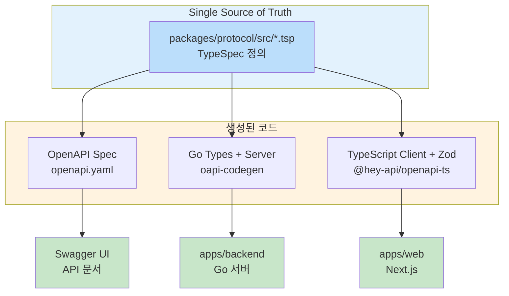
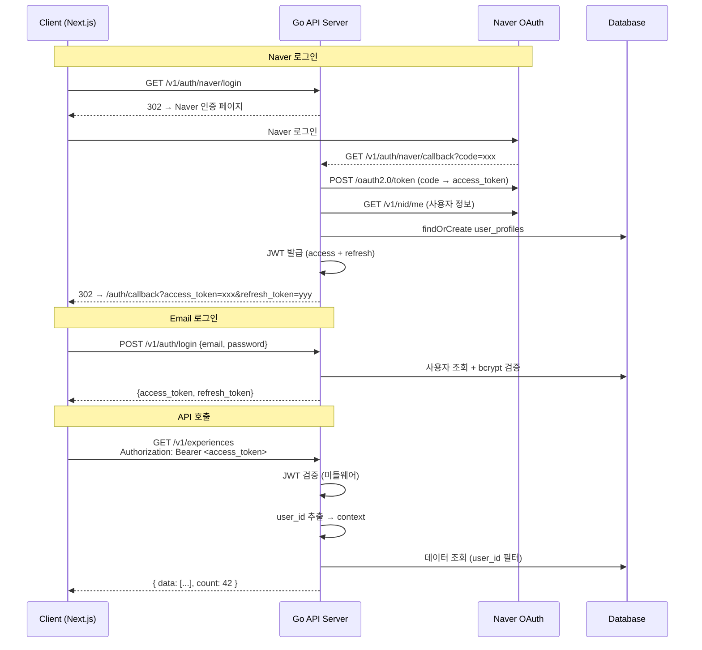

# API 설계 패턴

> 작성일: 2026-02-11

---

## 1. API 스펙 워크플로우

모노레포의 장점을 활용하여 **API 스펙을 단일 소스(Single Source of Truth)**로 관리합니다.
TypeSpec으로 API를 정의하면 Backend(Go), Frontend(TypeScript) 모두에서 사용할 수 있는 코드가 자동 생성됩니다.

```
TypeSpec 정의 (packages/protocol/src/)
    ↓ tsp compile
OpenAPI YAML (packages/protocol/tsp-output/openapi/openapi.yaml)
    ↓ oapi-codegen
Go 서버 인터페이스 (apps/backend/internal/generated/api.gen.go)
    ↓ @hey-api/openapi-ts
TS 클라이언트 SDK (apps/web/src/api/generated/)
```



### 장점

| 장점 | 설명 |
|-----|------|
| **일관성** | Frontend/Backend 간 API 타입 불일치 방지 |
| **자동화** | 스펙 변경 시 코드 자동 생성 |
| **문서화** | OpenAPI 스펙으로 Swagger UI 자동 생성 |
| **타입 안전성** | Go/TypeScript 모두 타입 체크 |
| **DX 향상** | API 변경 시 컴파일 타임에 오류 감지 |

---

## 2. TypeSpec 구조

```
packages/protocol/
├── src/
│   ├── main.tsp                # 엔트리 포인트
│   ├── common/
│   │   ├── errors.tsp          # 공통 에러 타입
│   │   ├── pagination.tsp      # 페이지네이션 모델
│   │   └── auth.tsp            # 인증 데코레이터
│   ├── auth/
│   │   └── auth.tsp            # 인증 API
│   ├── experience/
│   │   └── experience.tsp      # 경험 CRUD
│   ├── analysis/
│   │   └── analysis.tsp        # 기업 분석
│   ├── coaching/
│   │   └── coaching.tsp        # 코칭 엔드포인트
│   ├── matching/
│   │   └── matching.tsp        # 경험 매칭
│   ├── admin/
│   │   └── admin.tsp            # 어드민 API
│   └── application/
│       └── application.tsp     # 지원 관리
├── tsp-output/
│   └── openapi/
│       └── openapi.yaml        # 생성된 OpenAPI 스펙
├── tspconfig.yaml
└── package.json
```

### TypeSpec 설정

#### packages/protocol/tspconfig.yaml

```yaml
emit:
  - "@typespec/openapi3"

options:
  "@typespec/openapi3":
    output-file: openapi.yaml
    emitter-output-dir: "{project-root}/tsp-output/openapi"
```

### 엔트리 포인트

#### packages/protocol/src/main.tsp

```typespec
import "@typespec/http";
import "@typespec/rest";
import "@typespec/openapi";

import "./common/errors.tsp";
import "./common/pagination.tsp";
import "./common/auth.tsp";
import "./auth/auth.tsp";
import "./experience/experience.tsp";
import "./analysis/analysis.tsp";
import "./coaching/coaching.tsp";
import "./matching/matching.tsp";
import "./application/application.tsp";

using TypeSpec.Http;
using TypeSpec.Rest;

@service({
  title: "Colight API",
  version: "1.0.0",
})
@server("http://localhost:9000", "Development server")
namespace Colight;
```

---

## 3. TypeSpec 예시

### 공통 에러 타입

```typespec
// packages/protocol/src/common/errors.tsp
namespace Colight.Common;

model ErrorDetail {
  message: string;
  code: string;
}

model ErrorResponse {
  error: ErrorDetail;
}
```

### 페이지네이션

```typespec
// packages/protocol/src/common/pagination.tsp
namespace Colight.Common;

model PaginationParams {
  @query limit?: int32 = 20;
  @query offset?: int32 = 0;
}
```

### Experience API

```typespec
// packages/protocol/src/experience/experience.tsp
import "@typespec/http";
import "@typespec/openapi";
import "../common/errors.tsp";

using TypeSpec.Http;

namespace Colight.Experience;

model Experience {
  id: string;
  @encodedName("application/json", "user_id")
  userId: string;
  title: string;
  category?: string;
  @encodedName("application/json", "period_start")
  periodStart?: string;
  @encodedName("application/json", "period_end")
  periodEnd?: string;
  role?: string;
  content: string;
  result?: string;
  source?: "manual" | "interview";
  @encodedName("application/json", "created_at")
  createdAt: utcDateTime;
  @encodedName("application/json", "updated_at")
  updatedAt: utcDateTime;
}

model CreateExperienceRequest {
  title: string;
  category?: string;
  @encodedName("application/json", "period_start")
  periodStart?: string;
  @encodedName("application/json", "period_end")
  periodEnd?: string;
  role?: string;
  content: string;
  result?: string;
  source?: "manual" | "interview";
}

model UpdateExperienceRequest {
  title?: string;
  category?: string;
  content?: string;
  result?: string;
}

model ExperienceWithDetails extends Experience {
  tags: Tag[];
  weapons: Weapon[];
  usages: Usage[];
}

model Tag {
  id: string;
  name: string;
  type: string;
}

model Weapon {
  @encodedName("application/json", "weapon_code")
  weaponCode: string;
  @encodedName("application/json", "weapon_name")
  weaponName: string;
  confidence: float32;
  @encodedName("application/json", "is_primary")
  isPrimary: boolean;
}

model Usage {
  id: string;
  @encodedName("application/json", "cover_letter_id")
  coverLetterId: string;
  @encodedName("application/json", "used_at")
  usedAt: utcDateTime;
}

model WeaponTagResult {
  @encodedName("application/json", "primary_weapon")
  primaryWeapon: Weapon;
  @encodedName("application/json", "secondary_weapons")
  secondaryWeapons: Weapon[];
  star: Record<string>;
  @encodedName("application/json", "matchable_questions")
  matchableQuestions: string[];
}

@route("/v1/experiences")
@useAuth(BearerAuth)
interface ExperienceAPI {
  @get
  @summary("List experiences")
  list(
    @query category?: string,
    @query weapon_code?: string,
    @query search?: string,
    @query limit?: int32 = 20,
    @query offset?: int32 = 0
  ): {
    @statusCode statusCode: 200;
    @body body: {
      data: Experience[];
      count: int32;
    };
  } | Common.ErrorResponse;

  @post
  @summary("Create experience")
  create(@body body: CreateExperienceRequest): {
    @statusCode statusCode: 201;
    @body body: {
      data: Experience;
    };
  } | Common.ErrorResponse;

  @get
  @route("/{id}")
  @summary("Get experience detail")
  get(@path id: string): {
    @statusCode statusCode: 200;
    @body body: {
      data: ExperienceWithDetails;
    };
  } | Common.ErrorResponse;

  @put
  @route("/{id}")
  @summary("Update experience")
  update(@path id: string, @body body: UpdateExperienceRequest): {
    @statusCode statusCode: 200;
    @body body: {
      data: Experience;
    };
  } | Common.ErrorResponse;

  @delete
  @route("/{id}")
  @summary("Delete experience")
  delete(@path id: string): {
    @statusCode statusCode: 200;
    @body body: {
      data: { success: boolean };
    };
  } | Common.ErrorResponse;

  @post
  @route("/{id}/tag")
  @summary("Auto-tag experience with weapons")
  tag(@path id: string): {
    @statusCode statusCode: 200;
    @body body: {
      data: WeaponTagResult;
    };
  } | Common.ErrorResponse;
}
```

---

## 4. 응답 형식 표준

### 단일 리소스 응답

```json
// 200 OK
{
  "data": {
    "id": "uuid",
    "title": "경험 제목"
  }
}
```

### 목록 응답

```json
// 200 OK
{
  "data": [
    { "id": "uuid", "title": "경험 1" },
    { "id": "uuid", "title": "경험 2" }
  ],
  "count": 42
}
```

### 에러 응답

```json
// 4xx / 5xx
{
  "error": {
    "message": "사용자에게 표시할 에러 메시지",
    "code": "VALIDATION_ERROR"
  }
}
```

### 에러 코드 체계

| HTTP 상태 | 에러 코드 | 설명 |
|-----------|----------|------|
| 400 | `VALIDATION_ERROR` | 입력값 유효성 검사 실패 |
| 401 | `UNAUTHORIZED` | 인증 필요 |
| 403 | `FORBIDDEN` | 권한 없음 |
| 404 | `NOT_FOUND` | 리소스를 찾을 수 없음 |
| 409 | `CONFLICT` | 중복 리소스 |
| 429 | `RATE_LIMITED` | 요청 한도 초과 |
| 500 | `INTERNAL_ERROR` | 서버 내부 오류 |
| 503 | `SERVICE_UNAVAILABLE` | 외부 서비스 오류 (AI API 등) |

> **참고**: 상세 에러 코드 카탈로그(AUTH_001, VALIDATION_001 등)는 `09-error-handling.md`를 참조하세요.

---

## 5. Go 백엔드 구현

### 코드 생성 설정

#### apps/backend/oapi-codegen.yaml

```yaml
package: generated
output: internal/generated/api.gen.go
generate:
  models: true
  gin-server: true
  strict-server: true
  embedded-spec: true
```

#### moon task (apps/backend/moon.yml)

```yaml
generate-api:
  command: oapi-codegen -config oapi-codegen.yaml ../../packages/protocol/tsp-output/openapi/openapi.yaml
  deps:
    - "protocol:generate"
```

### 컨트롤러 구현

컨트롤러는 `oapi-codegen`이 생성한 `StrictServerInterface`를 구현합니다.

```go
// apps/backend/internal/controller/experience_controller.go
package controller

import (
    "context"

    "github.com/colight/backend/internal/generated"
    "github.com/colight/backend/internal/service"
)

type ExperienceController struct {
    experienceService *service.ExperienceService
}

// 인터페이스 구현 확인 (컴파일 타임)
var _ generated.StrictServerInterface = (*ExperienceController)(nil)

func (c *ExperienceController) List(
    ctx context.Context,
    request generated.ListRequestObject,
) (generated.ListResponseObject, error) {
    experiences, count, err := c.experienceService.List(ctx, service.ListParams{
        Category:   request.Params.Category,
        WeaponCode: request.Params.WeaponCode,
        Search:     request.Params.Search,
        Limit:      request.Params.Limit,
        Offset:     request.Params.Offset,
    })
    if err != nil {
        return generated.List500JSONResponse{
            Error: generated.ErrorDetail{
                Message: "서버 오류가 발생했습니다.",
                Code:    "INTERNAL_ERROR",
            },
        }, nil
    }

    return generated.List200JSONResponse{
        Data:  mapExperiences(experiences),
        Count: int32(count),
    }, nil
}

func (c *ExperienceController) Create(
    ctx context.Context,
    request generated.CreateRequestObject,
) (generated.CreateResponseObject, error) {
    exp, err := c.experienceService.Create(ctx, request.Body)
    if err != nil {
        return generated.Create400JSONResponse{
            Error: generated.ErrorDetail{
                Message: err.Error(),
                Code:    "VALIDATION_ERROR",
            },
        }, nil
    }

    return generated.Create201JSONResponse{
        Data: mapExperience(exp),
    }, nil
}
```

### 서비스 레이어

```go
// apps/backend/internal/service/experience_service.go
package service

import (
    "context"

    "github.com/colight/backend/internal/repository"
)

type ExperienceService struct {
    repo      *repository.ExperienceRepository
    aiClient  *AIClient
}

func (s *ExperienceService) Create(ctx context.Context, req CreateExperienceParams) (*Experience, error) {
    // 1. DB에 경험 저장
    exp, err := s.repo.Create(ctx, req)
    if err != nil {
        return nil, err
    }

    // 2. 임베딩 생성 (비동기)
    go s.generateEmbedding(context.Background(), exp.ID, exp.Content)

    return exp, nil
}
```

### 응답 헬퍼

```go
// apps/backend/internal/controller/response/response.go
package response

import "github.com/colight/backend/internal/generated"

func Error(message, code string) generated.ErrorDetail {
    return generated.ErrorDetail{
        Message: message,
        Code:    code,
    }
}

func ValidationError(message string) generated.ErrorDetail {
    return Error(message, "VALIDATION_ERROR")
}

func NotFoundError() generated.ErrorDetail {
    return Error("리소스를 찾을 수 없습니다.", "NOT_FOUND")
}

func InternalError() generated.ErrorDetail {
    return Error("서버 오류가 발생했습니다.", "INTERNAL_ERROR")
}
```

---

## 6. 인증 흐름

> **변경 (2026-02-13)**: Supabase Auth 제거. Go 백엔드에서 Naver OAuth + Email/Password 직접 처리.
> 상세 구현: `docs/develop/phases/phase-1.3-backend-auth.md`

### 전체 흐름



### Go 인증 미들웨어

```go
// apps/backend/internal/middleware/auth.go
package middleware

import (
    "github.com/gin-gonic/gin"
    "github.com/golang-jwt/jwt/v5"
)

func AuthMiddleware(jwtSecret string) gin.HandlerFunc {
    return func(c *gin.Context) {
        tokenString := extractBearerToken(c.GetHeader("Authorization"))
        if tokenString == "" {
            c.AbortWithStatusJSON(401, gin.H{
                "error": gin.H{
                    "message": "인증이 필요합니다.",
                    "code":    "UNAUTHORIZED",
                },
            })
            return
        }

        claims, err := validateJWT(tokenString, jwtSecret)
        if err != nil {
            c.AbortWithStatusJSON(401, gin.H{
                "error": gin.H{
                    "message": "유효하지 않은 토큰입니다.",
                    "code":    "UNAUTHORIZED",
                },
            })
            return
        }

        // user_id를 context에 저장
        c.Set("user_id", claims.Subject)
        c.Next()
    }
}
```

### 프론트엔드 인증 헤더 설정

```typescript
// apps/web/src/lib/api-client.ts
import axios from "axios";
import { useAuthStore } from "@/stores/auth-store";

export const apiClient = axios.create({
  baseURL: process.env.NEXT_PUBLIC_API_URL || "http://localhost:9000",
  headers: { "Content-Type": "application/json" },
});

// Request interceptor — 토큰 자동 첨부
apiClient.interceptors.request.use((config) => {
  const { accessToken } = useAuthStore.getState();
  if (accessToken) {
    config.headers.Authorization = `Bearer ${accessToken}`;
  }
  return config;
});
```

---

## 7. 프론트엔드 사용

### 생성된 파일 구조

```
apps/web/src/api/generated/
├── types.gen.ts     # TypeScript 타입 정의
├── sdk.gen.ts       # API 호출 함수 (SDK)
├── zod.gen.ts       # Zod 유효성 검증 스키마
└── client.gen.ts    # HTTP 클라이언트 설정
```

### openapi-ts 설정

```typescript
// apps/web/openapi-ts.config.ts
import { defineConfig } from '@hey-api/openapi-ts';

export default defineConfig({
  input: '../../packages/protocol/tsp-output/openapi/openapi.yaml',
  output: {
    path: 'src/api/generated',
    format: 'prettier',
  },
  plugins: [
    '@hey-api/typescript',
    '@hey-api/sdk',
    { name: 'zod' },
  ],
});
```

### SDK 사용 예시

```typescript
// apps/web/src/hooks/use-experiences.ts
import { useQuery, useMutation, useQueryClient } from '@tanstack/react-query';
import { experienceApiList, experienceApiCreate, experienceApiGet } from '@/api/generated/sdk.gen';
import type { Experience, CreateExperienceRequest } from '@/api/generated/types.gen';

export function useExperiences(params?: { category?: string; search?: string }) {
  return useQuery({
    queryKey: ['experiences', params],
    queryFn: async () => {
      const { data, error } = await experienceApiList({
        query: {
          category: params?.category,
          search: params?.search,
        },
      });
      if (error) throw error;
      return data;
    },
  });
}

export function useExperience(id: string) {
  return useQuery({
    queryKey: ['experience', id],
    queryFn: async () => {
      const { data, error } = await experienceApiGet({ path: { id } });
      if (error) throw error;
      return data.data;
    },
  });
}

export function useCreateExperience() {
  const queryClient = useQueryClient();

  return useMutation({
    mutationFn: async (body: CreateExperienceRequest) => {
      const { data, error } = await experienceApiCreate({ body });
      if (error) throw error;
      return data.data;
    },
    onSuccess: () => {
      queryClient.invalidateQueries({ queryKey: ['experiences'] });
    },
  });
}
```

### Zod 스키마 활용

```typescript
// 폼 유효성 검증에 생성된 Zod 스키마 사용
import { zCreateExperienceRequest } from '@/api/generated/zod.gen';

const validated = zCreateExperienceRequest.parse(formData);
```

---

## 8. 스트리밍 패턴 (AI 코칭)

AI 코칭 응답은 SSE(Server-Sent Events)를 사용하여 실시간 스트리밍합니다.

### Go 서버 (SSE)

```go
// apps/backend/internal/controller/coaching_controller.go
func (c *CoachingController) StreamDraft(ctx *gin.Context) {
    ctx.Header("Content-Type", "text/event-stream")
    ctx.Header("Cache-Control", "no-cache")
    ctx.Header("Connection", "keep-alive")

    // AI 스트리밍 응답
    stream, err := c.coachingService.GenerateDraft(ctx, params)
    if err != nil {
        ctx.SSEvent("error", gin.H{"message": err.Error()})
        return
    }

    ctx.Stream(func(w io.Writer) bool {
        chunk, ok := <-stream
        if !ok {
            return false
        }
        ctx.SSEvent("message", chunk)
        return true
    })
}
```

### 프론트엔드 (Vercel AI SDK)

```typescript
// apps/web/src/components/coaching/coaching-chat.tsx
import { useChat } from '@ai-sdk/react';
import { useAuthStore } from '@/stores/auth-store';

function CoachingChat() {
  const { accessToken } = useAuthStore();
  const { messages, input, handleSubmit, isLoading } = useChat({
    api: `${process.env.NEXT_PUBLIC_API_URL}/v1/coaching/draft`,
    headers: {
      Authorization: `Bearer ${accessToken}`,
    },
  });

  return (
    <div>
      {messages.map((m) => (
        <div key={m.id}>{m.content}</div>
      ))}
    </div>
  );
}
```

---

## 9. 엔드포인트 카탈로그

Base URL: `/v1`

### 9.1 인증 (Auth)

> **변경 (2026-02-13)**: Go 백엔드에서 Naver OAuth + Email/Password 인증을 직접 처리합니다.
> 상세: `docs/develop/phases/phase-1.2-api-definition.md`

| 메서드 | 엔드포인트 | 설명 | 인증 |
|--------|-----------|------|------|
| `GET` | `/v1/auth/naver/login` | Naver OAuth 시작 (302 → Naver) | 불필요 |
| `GET` | `/v1/auth/naver/callback` | Naver OAuth 콜백 처리 | 불필요 |
| `POST` | `/v1/auth/signup` | Email 회원가입 | 불필요 |
| `POST` | `/v1/auth/login` | Email 로그인 | 불필요 |
| `POST` | `/v1/auth/refresh` | 토큰 갱신 | 불필요 |
| `GET` | `/v1/auth/me` | 현재 사용자 정보 | 필요 |
| `POST` | `/v1/auth/logout` | 로그아웃 | 필요 |

### 9.1.1 어드민 (Admin)

| 메서드 | 엔드포인트 | 설명 | 인증 |
|--------|-----------|------|------|
| `GET` | `/v1/admin/stats` | 시스템 통계 | 어드민 |
| `GET` | `/v1/admin/users` | 사용자 목록 | 어드민 |
| `GET` | `/v1/admin/users/:id` | 사용자 상세 | 어드민 |
| `PUT` | `/v1/admin/users/:id/role` | 역할 변경 | 어드민 |
| `GET` | `/v1/admin/prompts` | 프롬프트 목록 | 어드민 |
| `PUT` | `/v1/admin/prompts/:id` | 프롬프트 수정 | 어드민 |

### 9.2 경험 관리 (Experiences)

| 메서드 | 엔드포인트 | 설명 | 인증 |
|--------|-----------|------|------|
| `GET` | `/v1/experiences` | 경험 목록 조회 | 필요 |
| `POST` | `/v1/experiences` | 경험 등록 | 필요 |
| `GET` | `/v1/experiences/:id` | 경험 상세 조회 | 필요 |
| `PUT` | `/v1/experiences/:id` | 경험 수정 | 필요 |
| `DELETE` | `/v1/experiences/:id` | 경험 삭제 | 필요 |
| `POST` | `/v1/experiences/:id/tag` | 무기 자동 태깅 | 필요 |

#### `POST /v1/experiences` - 경험 등록

| 항목 | 내용 |
|------|------|
| **요청** | `{ title: string, category?: string, period_start?: string, period_end?: string, role?: string, content: string, result?: string, source?: 'manual' \| 'interview' }` |
| **응답** | `{ data: Experience }` (201) |
| **설명** | 경험 생성 + 임베딩 자동 생성 (비동기) |

#### `POST /v1/experiences/:id/tag` - 무기 자동 태깅

| 항목 | 내용 |
|------|------|
| **요청** | Path: `id` |
| **응답** | `{ data: { primary_weapon, secondary_weapons, star, matchable_questions } }` |
| **설명** | 경량 모델 (Gemini/Groq)로 경험 분석 → 무기 자동 분류 + STAR 추출 |
| **모델** | 경량 모델 (Gemini/Groq) (~3~5원) |

### 9.3 기업 분석 (Analysis)

| 메서드 | 엔드포인트 | 설명 | 인증 |
|--------|-----------|------|------|
| `POST` | `/v1/analyze` | 기업 종합 분석 (SSE) | 필요 |
| `GET` | `/v1/analyze/:id` | 분석 결과 조회 | 필요 |
| `GET` | `/v1/analyze/company-data` | 기업 데이터 조회 | 필요 |

#### `POST /v1/analyze` - 기업 종합 분석

| 항목 | 내용 |
|------|------|
| **요청** | `{ url: string }` |
| **응답** | 스트리밍 (SSE) → `CompanyAnalysisResult` |
| **설명** | 채용공고 URL → 파싱 → 기업 정보 수집 → AI 종합 분석 |
| **모델** | 경량 모델 (Gemini/Groq) (파싱, ~3~5원) + Claude Sonnet 4.5 (분석, ~65원) |
| **캐시** | company_analysis_cache 7일 TTL |

### 9.4 AI 코칭 (Coaching)

| 메서드 | 엔드포인트 | 설명 | 인증 |
|--------|-----------|------|------|
| `POST` | `/v1/coaching/question-analysis` | 문항 분석 | 필요 |
| `POST` | `/v1/coaching/draft` | 초안 코칭 (SSE) | 필요 |
| `POST` | `/v1/coaching/review` | 첨삭 코칭 (SSE) | 필요 |

#### `POST /v1/coaching/question-analysis` - 문항 분석

| 항목 | 내용 |
|------|------|
| **요청** | `{ question_text: string, char_limit?: number, company_analysis_id?: string }` |
| **응답** | `{ data: QuestionAnalysis }` |
| **설명** | 자소서 문항 의도 분석 + 필요 무기 판단 + 작성 전략 |
| **모델** | Claude Sonnet 4.5 (~65원) |

#### `POST /v1/coaching/draft` - 초안 코칭

| 항목 | 내용 |
|------|------|
| **요청** | `{ cover_letter_id: string, experience_ids: string[], question_analysis: QuestionAnalysis }` |
| **응답** | 스트리밍 (SSE) → 코칭 텍스트 |
| **설명** | 선택 경험 기반 STAR 구조 초안 코칭 |
| **모델** | Claude Sonnet 4.5 (~65원) |

#### `POST /v1/coaching/review` - 첨삭 코칭

| 항목 | 내용 |
|------|------|
| **요청** | `{ cover_letter_id: string, content: string, version_number: number }` |
| **응답** | 스트리밍 (SSE) → 첨삭 피드백 |
| **설명** | 작성된 자소서 4개 지표 평가 + 구체적 개선 제안 |
| **모델** | Claude Sonnet 4.5 (~65원) |

### 9.5 경험 매칭 (Matching)

| 메서드 | 엔드포인트 | 설명 | 인증 |
|--------|-----------|------|------|
| `POST` | `/v1/matching` | 경험-기업 매칭 | 필요 |

#### `POST /v1/matching` - 경험-기업 매칭

| 항목 | 내용 |
|------|------|
| **요청** | `{ company_analysis_id: string, experience_ids?: string[] }` |
| **응답** | `{ data: { overall_fit, category_scores, experience_matches, recommendations } }` |
| **설명** | 하이브리드 매칭: 임베딩 유사도(1차 필터) → LLM 정밀 분석(2차) |
| **모델** | text-embedding-3-small (~0.5원) + 경량 모델 (Gemini/Groq) (~3~5원) |

### 9.6 지원 관리 (Applications)

| 메서드 | 엔드포인트 | 설명 | 인증 |
|--------|-----------|------|------|
| `GET` | `/v1/applications` | 지원 목록 조회 | 필요 |
| `POST` | `/v1/applications` | 지원 등록 | 필요 |
| `GET` | `/v1/applications/:id` | 지원 상세 | 필요 |
| `PUT` | `/v1/applications/:id` | 지원 수정 | 필요 |
| `DELETE` | `/v1/applications/:id` | 지원 삭제 | 필요 |

---

## 10. 코드 생성 명령어

```bash
# 1. TypeSpec → OpenAPI 생성
cd packages/protocol && pnpm run generate

# 2. OpenAPI → Go 서버 코드 생성
moon run backend:generate-api

# 3. OpenAPI → TypeScript 클라이언트 + Zod 생성
moon run web:generate-client

# 한 번에 실행 (루트에서)
moon run protocol:generate && moon run backend:generate-api && moon run web:generate-client
```

### 실행 순서

```mermaid
flowchart TD
    subgraph Step1["1. TypeSpec 정의"]
        TSP_SRC[packages/protocol/src/**/*.tsp<br/>API 스펙 작성]
    end

    Step1 -->|pnpm run generate| Step2

    subgraph Step2["2. OpenAPI 스펙 생성"]
        OPENAPI[tsp-output/openapi/openapi.yaml]
    end

    Step2 --> Step3a
    Step2 --> Step3b

    subgraph Step3a["3a. Go 서버 코드 생성"]
        OAPI[oapi-codegen]
        GO_GEN[apps/backend/internal/generated/]
        OAPI --> GO_GEN
    end

    subgraph Step3b["3b. TypeScript 클라이언트 + Zod"]
        OPENAPI_GEN[@hey-api/openapi-ts]
        TS_GEN[apps/web/src/api/generated/]
        OPENAPI_GEN --> TS_GEN
    end

    style Step1 fill:#e1f5fe
    style Step2 fill:#fff3e0
    style Step3a fill:#e8f5e9
    style Step3b fill:#fce4ec
```

**API가 바뀌면:**
1. TypeSpec 수정 (`packages/protocol/src/`)
2. `pnpm run generate` (루트에서 한 번에 실행)
3. Frontend/Backend 타입, SDK, Zod 스키마가 자동 동기화

---

## 11. Rate Limiting 전략

### Freemium 제한

| 리소스 | 무료 사용자 | 향후 Pro |
|--------|-----------|---------|
| 경험 등록 | 20개 | 무제한 |
| 기업 분석 | 5건/월 | 무제한 |
| 코칭 세션 | 10회/월 | 무제한 |
| AI 인터뷰 | 5회/월 | 무제한 |

### Go 미들웨어 구현

```go
// apps/backend/internal/middleware/rate_limit.go
func RateLimitMiddleware(repo *repository.UsageRepository) gin.HandlerFunc {
    return func(c *gin.Context) {
        userID := c.GetString("user_id")
        resource := extractResource(c.Request.URL.Path)

        count, err := repo.GetMonthlyUsage(c, userID, resource)
        if err != nil {
            c.Next()
            return
        }

        limits := map[string]int{
            "analysis":  5,
            "coaching":  10,
            "interview": 5,
        }

        if limit, ok := limits[resource]; ok && count >= limit {
            c.AbortWithStatusJSON(429, gin.H{
                "error": gin.H{
                    "message": "이번 달 무료 사용 한도를 초과했습니다.",
                    "code":    "RATE_LIMITED",
                },
            })
            return
        }

        c.Next()
    }
}
```
