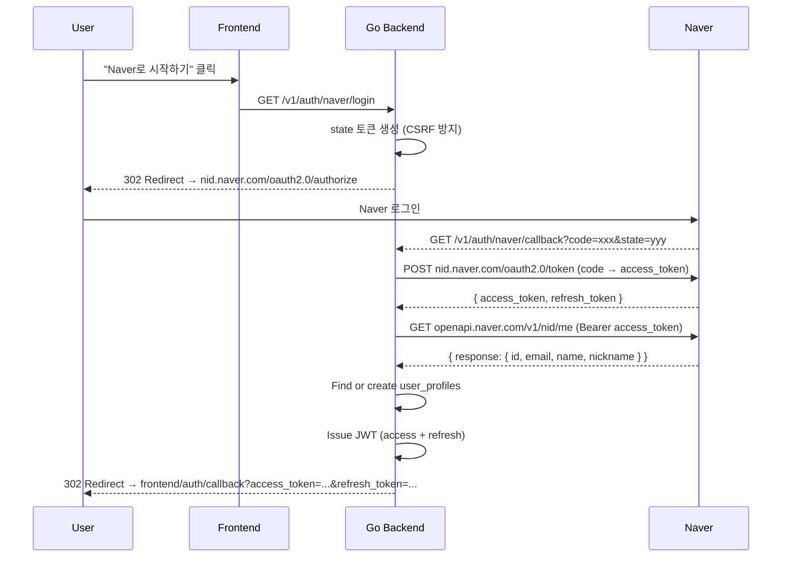

# Phase 1.3: Go 백엔드 인증

## 목표

Go 백엔드에서 Naver OAuth 2.0, Email/Password 인증, JWT 토큰 시스템, 어드민 미들웨어를 구현한다.

---

## 디렉토리 구조

```text
apps/backend/internal/
├── infrastructure/
│   ├── config/
│   │   └── config.go          # 환경변수 로드 (Naver, JWT 등)
│   ├── middleware/
│   │   ├── auth.go            # JWT 검증 미들웨어
│   │   ├── admin.go           # 어드민 역할 검증 미들웨어
│   │   └── cors.go            # CORS 설정
│   └── database/
│       └── database.go        # DB 연결
├── service/
│   ├── auth_service.go        # 인증 비즈니스 로직
│   └── token_service.go       # JWT 토큰 생성/검증
├── controller/
│   ├── auth_controller.go     # Auth API 핸들러
│   └── admin_controller.go    # Admin API 핸들러
└── generated/
    └── api.gen.go             # oapi-codegen 생성
```

---

## A. 환경변수 설정

### `internal/infrastructure/config/config.go`

```go
type Config struct {
    // Server
    APIPort string

    // Database
    DatabaseURL string

    // Naver OAuth
    NaverClientID     string
    NaverClientSecret string
    NaverCallbackURL  string

    // JWT
    JWTSecret          string   // HMAC-SHA256 signing key
    JWTAccessTokenTTL  time.Duration  // default: 1h
    JWTRefreshTokenTTL time.Duration  // default: 7d

    // Frontend
    FrontendURL string  // http://localhost:4000

    // AI
    AnthropicAPIKey string
    OpenAIAPIKey    string
}
```

### 환경변수 매핑

| 환경변수 | Config 필드 | 기본값 |
|---------|------------|--------|
| `API_PORT` | APIPort | `9000` |
| `DATABASE_URL` | DatabaseURL | - |
| `NAVER_CLIENT_ID` | NaverClientID | - |
| `NAVER_CLIENT_SECRET` | NaverClientSecret | - |
| `NAVER_CALLBACK_URL` | NaverCallbackURL | `http://localhost:9000/v1/auth/naver/callback` |
| `JWT_SECRET` | JWTSecret | - (필수, 최소 32자) |
| `JWT_ACCESS_TOKEN_TTL` | JWTAccessTokenTTL | `1h` |
| `JWT_REFRESH_TOKEN_TTL` | JWTRefreshTokenTTL | `168h` (7일) |
| `FRONTEND_URL` | FrontendURL | `http://localhost:4000` |

---

## B. Naver OAuth 구현

### Naver OAuth 2.0 흐름



### `internal/service/auth_service.go` 핵심 로직

```go
type AuthService struct {
    config       *config.Config
    db           *ent.Client
    tokenService *TokenService
    httpClient   *http.Client
}

// NaverUserInfo — Naver API 응답 구조
type NaverUserInfo struct {
    ResultCode string `json:"resultcode"`
    Message    string `json:"message"`
    Response   struct {
        ID       string `json:"id"`
        Email    string `json:"email"`
        Name     string `json:"name"`
        Nickname string `json:"nickname"`
    } `json:"response"`
}

// GetNaverAuthURL — Naver 로그인 URL 생성
func (s *AuthService) GetNaverAuthURL() (authURL string, state string) {
    state = generateRandomState() // crypto/rand, 32 bytes hex

    params := url.Values{
        "response_type": {"code"},
        "client_id":     {s.config.NaverClientID},
        "redirect_uri":  {s.config.NaverCallbackURL},
        "state":         {state},
    }

    return "https://nid.naver.com/oauth2.0/authorize?" + params.Encode(), state
}

// HandleNaverCallback — OAuth 콜백 처리
func (s *AuthService) HandleNaverCallback(ctx context.Context, code, state string) (*AuthResult, error) {
    // 1. Exchange code for access token
    naverToken, err := s.exchangeNaverCode(code, state)
    if err != nil {
        return nil, fmt.Errorf("token exchange failed: %w", err)
    }

    // 2. Fetch user info from Naver
    naverUser, err := s.fetchNaverUserInfo(naverToken.AccessToken)
    if err != nil {
        return nil, fmt.Errorf("user info fetch failed: %w", err)
    }

    // 3. Find or create user
    user, err := s.findOrCreateNaverUser(ctx, naverUser)
    if err != nil {
        return nil, fmt.Errorf("user upsert failed: %w", err)
    }

    // 4. Update last_login_at
    s.db.UserProfile.UpdateOneID(user.ID).
        SetLastLoginAt(time.Now()).
        Exec(ctx)

    // 5. Issue JWT tokens
    tokens, err := s.tokenService.IssueTokenPair(user.ID, user.Role)
    if err != nil {
        return nil, fmt.Errorf("token issue failed: %w", err)
    }

    return &AuthResult{User: user, Tokens: tokens}, nil
}

// exchangeNaverCode — POST nid.naver.com/oauth2.0/token
func (s *AuthService) exchangeNaverCode(code, state string) (*NaverTokenResponse, error) {
    params := url.Values{
        "grant_type":    {"authorization_code"},
        "client_id":     {s.config.NaverClientID},
        "client_secret": {s.config.NaverClientSecret},
        "code":          {code},
        "state":         {state},
    }

    resp, err := s.httpClient.PostForm("https://nid.naver.com/oauth2.0/token", params)
    // ... parse response
}

// fetchNaverUserInfo — GET openapi.naver.com/v1/nid/me
func (s *AuthService) fetchNaverUserInfo(accessToken string) (*NaverUserInfo, error) {
    req, _ := http.NewRequest("GET", "https://openapi.naver.com/v1/nid/me", nil)
    req.Header.Set("Authorization", "Bearer "+accessToken)

    resp, err := s.httpClient.Do(req)
    // ... parse response
}

// findOrCreateNaverUser — DB에서 naver_id로 검색, 없으면 생성
func (s *AuthService) findOrCreateNaverUser(ctx context.Context, info *NaverUserInfo) (*ent.UserProfile, error) {
    // Try find by naver_id
    user, err := s.db.UserProfile.Query().
        Where(userprofile.NaverIDEQ(info.Response.ID)).
        Only(ctx)

    if err == nil {
        return user, nil // existing user
    }

    if !ent.IsNotFound(err) {
        return nil, err
    }

    // Create new user
    return s.db.UserProfile.Create().
        SetNaverID(info.Response.ID).
        SetEmail(info.Response.Email).
        SetNickname(info.Response.Nickname).
        SetAuthProvider(userprofile.AuthProviderNaver).
        SetEmailVerified(true). // Naver email is verified
        SetRole(userprofile.RoleUser).
        Save(ctx)
}
```

---

## C. Email/Password 인증

```go
// Signup — 이메일 회원가입
func (s *AuthService) Signup(ctx context.Context, email, password, nickname string) (*AuthResult, error) {
    // 1. Check duplicate email
    exists, _ := s.db.UserProfile.Query().
        Where(userprofile.EmailEQ(email)).
        Exist(ctx)
    if exists {
        return nil, ErrEmailAlreadyExists
    }

    // 2. Hash password (bcrypt, cost 12)
    hash, err := bcrypt.GenerateFromPassword([]byte(password), 12)
    if err != nil {
        return nil, fmt.Errorf("password hash failed: %w", err)
    }

    // 3. Create user
    user, err := s.db.UserProfile.Create().
        SetEmail(email).
        SetPasswordHash(string(hash)).
        SetNickname(nickname).
        SetAuthProvider(userprofile.AuthProviderEmail).
        SetRole(userprofile.RoleUser).
        Save(ctx)
    if err != nil {
        return nil, err
    }

    // 4. Issue JWT
    tokens, err := s.tokenService.IssueTokenPair(user.ID, user.Role)
    return &AuthResult{User: user, Tokens: tokens}, nil
}

// Login — 이메일 로그인
func (s *AuthService) Login(ctx context.Context, email, password string) (*AuthResult, error) {
    // 1. Find user by email
    user, err := s.db.UserProfile.Query().
        Where(userprofile.EmailEQ(email)).
        Only(ctx)
    if err != nil {
        return nil, ErrInvalidCredentials
    }

    // 2. Verify password
    if err := bcrypt.CompareHashAndPassword([]byte(user.PasswordHash), []byte(password)); err != nil {
        return nil, ErrInvalidCredentials
    }

    // 3. Update last_login_at
    s.db.UserProfile.UpdateOneID(user.ID).
        SetLastLoginAt(time.Now()).
        Exec(ctx)

    // 4. Issue JWT
    tokens, err := s.tokenService.IssueTokenPair(user.ID, user.Role)
    return &AuthResult{User: user, Tokens: tokens}, nil
}
```

---

## D. JWT 토큰 시스템

### `internal/service/token_service.go`

```go
type TokenService struct {
    secret          []byte
    accessTokenTTL  time.Duration
    refreshTokenTTL time.Duration
}

type TokenClaims struct {
    jwt.RegisteredClaims
    Role string `json:"role"`
}

// IssueTokenPair — access + refresh 토큰 생성
func (s *TokenService) IssueTokenPair(userID uuid.UUID, role userprofile.Role) (*TokenPair, error) {
    now := time.Now()

    // Access Token (1h)
    accessClaims := TokenClaims{
        RegisteredClaims: jwt.RegisteredClaims{
            Subject:   userID.String(),
            IssuedAt:  jwt.NewNumericDate(now),
            ExpiresAt: jwt.NewNumericDate(now.Add(s.accessTokenTTL)),
            Issuer:    "colight",
        },
        Role: string(role),
    }
    accessToken, err := jwt.NewWithClaims(jwt.SigningMethodHS256, accessClaims).
        SignedString(s.secret)
    if err != nil {
        return nil, err
    }

    // Refresh Token (7d)
    refreshClaims := jwt.RegisteredClaims{
        Subject:   userID.String(),
        IssuedAt:  jwt.NewNumericDate(now),
        ExpiresAt: jwt.NewNumericDate(now.Add(s.refreshTokenTTL)),
        Issuer:    "colight",
        ID:        uuid.New().String(), // jti for revocation
    }
    refreshToken, err := jwt.NewWithClaims(jwt.SigningMethodHS256, refreshClaims).
        SignedString(s.secret)
    if err != nil {
        return nil, err
    }

    return &TokenPair{
        AccessToken:  accessToken,
        RefreshToken: refreshToken,
        ExpiresIn:    int32(s.accessTokenTTL.Seconds()),
    }, nil
}

// ValidateAccessToken — access token 검증 + claims 추출
func (s *TokenService) ValidateAccessToken(tokenString string) (*TokenClaims, error) {
    token, err := jwt.ParseWithClaims(tokenString, &TokenClaims{}, func(t *jwt.Token) (interface{}, error) {
        if _, ok := t.Method.(*jwt.SigningMethodHMAC); !ok {
            return nil, fmt.Errorf("unexpected signing method: %v", t.Header["alg"])
        }
        return s.secret, nil
    })
    if err != nil {
        return nil, err
    }
    claims, ok := token.Claims.(*TokenClaims)
    if !ok || !token.Valid {
        return nil, ErrInvalidToken
    }
    return claims, nil
}
```

---

## E. 미들웨어

### Auth 미들웨어 (`middleware/auth.go`)

```go
func AuthMiddleware(tokenService *service.TokenService) gin.HandlerFunc {
    return func(c *gin.Context) {
        tokenString := extractBearerToken(c.GetHeader("Authorization"))
        if tokenString == "" {
            c.AbortWithStatusJSON(401, gin.H{
                "error": gin.H{"message": "인증이 필요합니다.", "code": "AUTH_001"},
            })
            return
        }

        claims, err := tokenService.ValidateAccessToken(tokenString)
        if err != nil {
            c.AbortWithStatusJSON(401, gin.H{
                "error": gin.H{"message": "유효하지 않은 토큰입니다.", "code": "AUTH_002"},
            })
            return
        }

        // context에 user_id, role 저장
        userID, _ := uuid.Parse(claims.Subject)
        c.Set("user_id", userID)
        c.Set("role", claims.Role)
        c.Next()
    }
}

func extractBearerToken(header string) string {
    if len(header) > 7 && header[:7] == "Bearer " {
        return header[7:]
    }
    return ""
}
```

### Admin 미들웨어 (`middleware/admin.go`)

```go
func AdminMiddleware() gin.HandlerFunc {
    return func(c *gin.Context) {
        role, exists := c.Get("role")
        if !exists || role != "admin" {
            c.AbortWithStatusJSON(403, gin.H{
                "error": gin.H{"message": "관리자 권한이 필요합니다.", "code": "AUTH_003"},
            })
            return
        }
        c.Next()
    }
}
```

### 라우터 설정

```go
func SetupRouter(cfg *config.Config, db *ent.Client) *gin.Engine {
    r := gin.Default()

    tokenService := service.NewTokenService(cfg)
    authService := service.NewAuthService(cfg, db, tokenService)

    authCtrl := controller.NewAuthController(authService)
    adminCtrl := controller.NewAdminController(db)

    // Public routes (인증 불필요)
    auth := r.Group("/v1/auth")
    {
        auth.GET("/naver/login", authCtrl.NaverLogin)
        auth.GET("/naver/callback", authCtrl.NaverCallback)
        auth.POST("/signup", authCtrl.Signup)
        auth.POST("/login", authCtrl.Login)
        auth.POST("/refresh", authCtrl.Refresh)
    }

    // Protected routes (인증 필요)
    protected := r.Group("/v1")
    protected.Use(middleware.AuthMiddleware(tokenService))
    {
        protected.GET("/auth/me", authCtrl.Me)
        protected.POST("/auth/logout", authCtrl.Logout)
    }

    // Admin routes (인증 + 어드민 역할 필요)
    admin := r.Group("/v1/admin")
    admin.Use(middleware.AuthMiddleware(tokenService))
    admin.Use(middleware.AdminMiddleware())
    {
        admin.GET("/users", adminCtrl.ListUsers)
        admin.GET("/users/:id", adminCtrl.GetUser)
        admin.PUT("/users/:id/role", adminCtrl.UpdateUserRole)
        admin.GET("/stats", adminCtrl.GetStats)
        admin.GET("/prompts", adminCtrl.ListPrompts)
        admin.PUT("/prompts/:id", adminCtrl.UpdatePrompt)
    }

    return r
}
```

---

## 체크리스트

### 환경변수 & 설정

- [x] `config.go` 수정 — Naver OAuth, JWT, Frontend URL 환경변수 추가
- [x] `.env` 업데이트 — JWT_SECRET, NAVER_CALLBACK_URL, FRONTEND_URL 추가
- [x] `.env.example` 업데이트

### Naver OAuth

- [x] Naver Developers 앱 등록 (수동 — [developers.naver.com](https://developers.naver.com))
  - [x] 앱 이름: Colight
  - [x] 사용 API: 네이버 아이디로 로그인
  - [x] Callback URL: `http://localhost:9000/v1/auth/naver/callback`
- [x] `service/auth_service.go` 구현
  - [x] `GetNaverAuthURL()` — Naver OAuth URL 생성 + state 토큰
  - [x] `HandleNaverCallback()` — code → token → userinfo → user upsert
  - [x] `exchangeNaverCode()` — POST nid.naver.com/oauth2.0/token
  - [x] `fetchNaverUserInfo()` — GET openapi.naver.com/v1/nid/me
  - [x] `findOrCreateNaverUser()` — DB upsert
- [x] `controller/auth_controller.go` 구현
  - [x] `NaverLogin` — GET /v1/auth/naver/login → 302 redirect
  - [x] `NaverCallback` — GET /v1/auth/naver/callback → JWT 발급 → 302 redirect to frontend

### Email/Password 인증

- [x] `auth_service.go`에 추가
  - [x] `Signup()` — 이메일 중복 체크 → bcrypt 해싱 → user 생성 → JWT
  - [x] `Login()` — 이메일 조회 → bcrypt 검증 → JWT
- [x] `auth_controller.go`에 추가
  - [x] `Signup` — POST /v1/auth/signup
  - [x] `Login` — POST /v1/auth/login

### JWT 토큰

- [x] `service/token_service.go` 구현
  - [x] `IssueTokenPair()` — access (1h) + refresh (7d) 토큰 생성
  - [x] `ValidateAccessToken()` — 토큰 검증 + claims 추출
  - [x] `RefreshAccessToken()` — refresh token으로 새 access token 발급
- [x] `controller/auth_controller.go`에 추가
  - [x] `Refresh` — POST /v1/auth/refresh
  - [x] `Me` — GET /v1/auth/me
  - [x] `Logout` — POST /v1/auth/logout

### 미들웨어

- [x] `middleware/auth.go` — JWT 검증, user_id + role context 저장
- [x] `middleware/admin.go` — role == "admin" 검증

### 라우터

- [x] `cmd/api/main.go` 수정 — 라우터 설정, 미들웨어 체인

### 테스트

- [x] Auth service unit tests
  - [x] Naver OAuth 흐름 (mock HTTP client)
  - [x] Email signup / login
  - [x] Password hash verification
- [x] Token service unit tests
  - [x] Token generation
  - [x] Token validation
  - [x] Expired token rejection
- [x] Middleware tests
  - [x] Valid token → 통과
  - [x] Invalid token → 401
  - [x] Admin middleware → 403

---

## 보안 체크리스트

- [x] JWT secret 최소 32자 (환경변수)
- [x] bcrypt cost 12 이상
- [x] CSRF state 토큰 검증 (Naver OAuth)
- [x] Naver callback URL 환경변수로 관리 (하드코딩 금지)
- [x] password_hash는 API 응답에 절대 노출하지 않음 (Ent `.Sensitive()`)
- [x] Rate limiting: 로그인 시도 제한 (IP당 분당 10회)

---

## 검증 방법

```bash
# 1. Naver OAuth 테스트 (브라우저)
open "http://localhost:9000/v1/auth/naver/login"
# → Naver 로그인 → 콜백 → 프론트엔드 리디렉션 + JWT 확인

# 2. Email 회원가입 테스트
curl -X POST http://localhost:9000/v1/auth/signup \
  -H "Content-Type: application/json" \
  -d '{"email":"test@example.com","password":"password123","nickname":"테스트"}'

# 3. Email 로그인 테스트
curl -X POST http://localhost:9000/v1/auth/login \
  -H "Content-Type: application/json" \
  -d '{"email":"test@example.com","password":"password123"}'

# 4. JWT 인증 테스트
curl http://localhost:9000/v1/auth/me \
  -H "Authorization: Bearer <access_token>"

# 5. 토큰 갱신 테스트
curl -X POST http://localhost:9000/v1/auth/refresh \
  -H "Content-Type: application/json" \
  -d '{"refresh_token":"<refresh_token>"}'
```

---

## 산출물

- `internal/infrastructure/config/config.go` (환경변수 설정)
- `internal/service/auth_service.go` (Naver OAuth + Email/PW)
- `internal/service/token_service.go` (JWT 토큰)
- `internal/infrastructure/middleware/auth.go` (인증 미들웨어)
- `internal/infrastructure/middleware/admin.go` (어드민 미들웨어)
- `internal/controller/auth_controller.go` (Auth API 핸들러)
- `internal/controller/admin_controller.go` (Admin API 핸들러)
